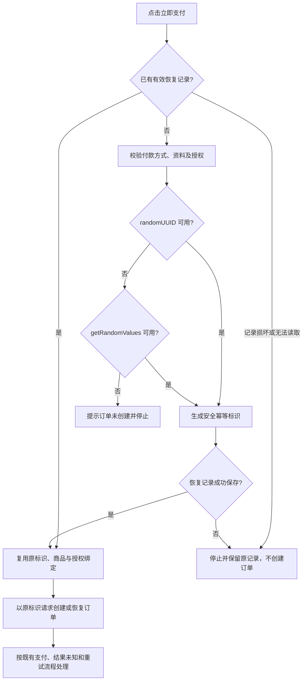

# 公共支付页安全下单标识兼容修复

## 问题与目标

2026-09-29 10:40 左右，用户在微信支付页点击「立即支付」后看到 `crypto.randomUUID is not a function`。生产包中的公共支付页在建立浏览器恢复记录前直接调用该 API；调用失败时没有创建订单。目标是在缺少 `randomUUID()`、但仍提供安全随机数的浏览器中继续原有支付流程，同时保持一次下单只使用一个可恢复的幂等标识。

## 业务判断流程

## 参考与复用

- [W3C Web Cryptography Level 2](https://www.w3.org/TR/webcrypto-2/) 将 `randomUUID()` 限于安全上下文，`getRandomValues()` 提供密码学安全随机字节。
- [uuidjs/uuid](https://github.com/uuidjs/uuid) 使用安全随机数，已移除不安全随机源的内置回退。此修复不增加库依赖，直接复用浏览器已有的 Web Crypto 能力。
- 仓内复用 Product Owner 的 `/pay/{code}` 页面、`checkoutRecord`／`writeCheckout` 恢复记录、原 `Idempotency-Key` 和 Payment HTTP 合同；不改订单、支付或 Provider 状态机。

## 页面体验审查（Product Design audit）

用户提供的失败态截图显示：支付方式已选、金额与「立即支付」仍可见，中部直接暴露英文 JavaScript 异常。页面没有说明订单是否创建，也没有下一步指引。此次只改该错误分支的功能与文案，不改变既有布局、视觉组件、支付方式选择或正常状态。截图不能证明浏览器版本、实际页面协议、无障碍读屏表现或 Provider 结果。

## 范围与边界

- **对外合同**：HTTP API、请求体和错误码不变；缺少 `randomUUID()` 且有 `getRandomValues()` 时仍提交原格式的安全幂等键。两者都缺少时显示「订单未创建」并禁止本次 POST。
- **业务机制**：只改变新恢复记录的浏览器端标识生成；已有恢复记录与 `create_attempted`、原键重试、响应不明和已支付读回保持不变。不增加随机数以外的限制。
- **关联模块**：Product 公共页生成并调用 Payment 创建／状态 API。Payment、Order、Coupon、身份授权和 Provider 的服务端实现不变。
- **页面影响**：公共商品／服务期 `/pay/{code}` 支付页；微信和支付宝选择共用该恢复记录。沿用页面现有状态栏，不引入新组件。
- **分类**：OneID 不涉及新身份处理，继续使用已有授权绑定；Persistence 为现有浏览器 sessionStorage 恢复记录，无服务端持久化变更；External Effects 不新增，支付 Provider 写入仍由原 Payment 合同处理。

## 验收与发布

1. 在缺少 `randomUUID()` 的实际渲染页面中，`getRandomValues()` 路径成功创建一次订单；刷新或重试保持同一标识，不重复创建。
2. 两种安全随机 API 均不可用时，页面显示中文停止提示、没有恢复记录和创建请求；正常 `randomUUID()` 路径不回归。
3. 验证 Product/Payment 相关 Go 测试、页面旅程及实际影响计划。预发由唯一发布指挥台以合成会话和虚拟 Provider 验证支付、恢复及失败态；真实微信扣款另行验收。
4. 无迁移、无新依赖；如预发失败，由原任务修复候选，发布指挥台保留队首顺序。已保存的恢复记录不清理、不重置。
