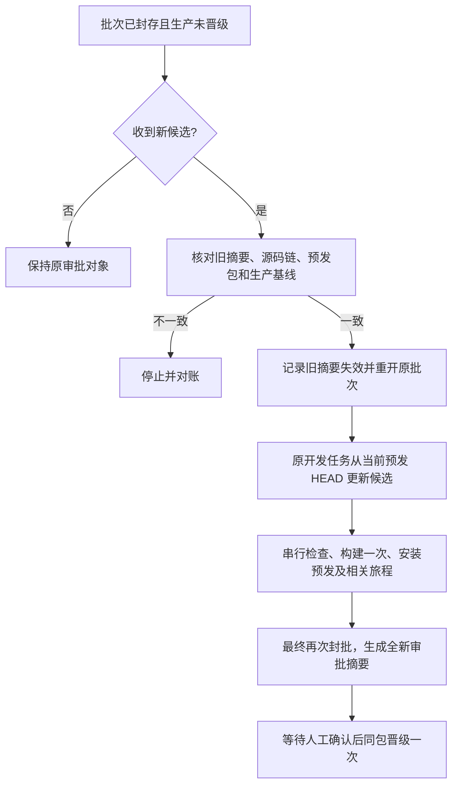

# 封批后继续累计预发

## 业务判断

用户希望已开发的需求依次进入唯一共享预发，并在最后一次性批准生产。当前批次 `P → A → A+B → A+B+C` 已封存，但尚无人批准；此时又收到支付页和商品标签候选。封批只是冻结审批对象，不应迫使未批准的批次先晋级生产。

## 参考与复用

- [GitLab Resource group](https://docs.gitlab.com/ci/resource_groups/) 的共享环境串行写入方式，与现有独占锁一致。
- [GitHub Deployment environments](https://docs.github.com/en/actions/concepts/workflows-and-actions/deployment-environments) 将预发和生产作为不同目标，并允许生产独立审批。本项目继续使用国内控制器，不引入 GitHub 门禁。
- 复用现有批次成员链、单一队列、锁、构件和旅程收据、生产游标及 `approval_digest`。不建立第二批次或第二执行器。

## 最小改动与验收

新增 `batch-reopen --approval-digest <当前封批摘要>`。仅当批次仍为 `sealed`、无在途尝试、无待处理队首且生产未变时，持原锁核对有序成员 ref/head/tree 第一父链、当前预发应用与最终旅程、完整源码 bundle、封批元数据、生产应用及源码游标。任何不一致都不改账本。成功时在原账本保留旧摘要、封批时间和元数据摘要作为历史，清除当前审批字段并转回 `open/ready`；旧摘要立即无法调用 `promote`。旧构件和收据不删除，生产不写入。下一候选仍须从当前预发 HEAD 出发，按既有检查和安装合同进入同一批次。再次封批必须重新验证最终累计版并产生新摘要。

本次重开功能自身修改发布控制器，命令同时接收 `--sha/--ref` 指向这个从旧预发 HEAD 延伸的源码候选。在核对已安装控制器字节并执行适用 Linux 工具检查后，原子地把它登记为源码成员、切换受信任控制器身份和重开批次；业务应用不重装。这样重开与控制器换版之间不会留下可晋级但控制器身份不明的状态。

实际追加支付页候选时，backend 检查的独立临时检出缺少 `internal/config/http/openapi.yaml` 派生视图，Go 测试在编译前退出。修复为每个独立检查检出从同一准确源码生成嵌入视图，并验证 OpenAPI 视图确实存在。原候选保留队首和“未评价”收据。若工具修复需要在队首代码重提之前生效，`batch-tool-repair` 只接受检查阶段未评价的准确失败候选，持锁验证预发、生产和源码链，完成工具 Linux 检查及 bundle 后在原批次登记源码成员；失败的业务候选仍是活动队首，由原任务沿新累计 HEAD 更新。代码断言失败不能用此入口越过。

原位替换允许原开发任务使用新 ref 保留旧候选证据，但必须提供被替换队首的准确候选 ID，且新提交以新的累计 HEAD 为第一父基线。保留原队列位置与失败 attempt 历史；需要预发恢复确认的失败仍按原恢复边界执行。

支付候选的定向 backend 检查再次显示“命令成功、收据不完整”：被选中的 `TestPostgreSQLPaymentActionsPublicCheckoutChromiumJourney` 因缺少显式 Chromium 开关而 skip。只对 backend 中明确按名称选中的 Chromium Journey 传入 `AICRM_REQUIRE_CHROMIUM_JOURNEY=1`，让原断言真实执行；普通 Go 测试不改变环境，也不把 skip 记成通过。工具修复走同一开放批次的源码成员，原支付候选保留队首，再由原开发任务沿新 HEAD 重提。

五项影响：对外只增加发布工具命令；不改变业务事务、身份、Provider 或页面；关联发布控制器、账本和合同测试；验证成功、错误摘要、预发改变、生产游标改变均不会误写生产。OneID 不涉及；Persistence 仅原发布账本；External Effects 仅预发控制状态，生产部署仍需独立人工批准。新增摘要参数复用现有封批对象身份校验，防止重开另一个批次；无数量和等待时限限制。
