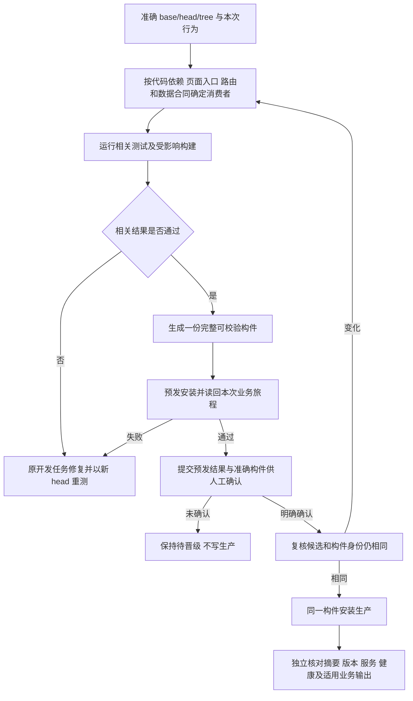

# PRD：按变更行为检查与构建的一条发布路径

> 2026-09-29 目标 PRD。按“没有现有部署和审核方案”重新设计；实施状态以候选提交及国内发布收据为准。

## 1. 要解决的事

一次裂变头像与留白的小修，因 `cmd/aicrm/composition.go` 被标为高风险而进入五条全量检查，运行了 229 个 Go 包。CPU profile 测试把五秒元数据下限卡在 4.999198696 秒；服务期页面测试在请求发起后固定等 30 毫秒就断言终态。这两项仍须在同环境基线复现，不能预先定为环境波动。

截图记录的是第二次 attempt 当时的状态。旧发布指挥台后来以第三次 attempt 将 `c6f2f34` 安装到预发和生产；构建时用了临时修补，源码仍需永久修复。候选代码显示：增量构建先创建 `release/web/dist`，首个分包脚本却要求目录不存在；完整构建先删目录再运行同一分包。构建器自身的目录约定互相冲突，与业务验收无关。

## 2. 产品目标

对每次候选，只回答六个问题：

1. **改了什么行为？** 固定准确 base、head、tree 和完整差异。
2. **相关行为通过了吗？** 运行改动的直接测试、跨边界合同和用户旅程，并核对所选测试确实执行且没有 skip。
3. **构件正确吗？** 从本次源码和身份已核实的基包生成一份完整构件；核对文件摘要、页面引用闭包和可访问边界。
4. **预发装入并表现正确吗？** 安装该构件，读取本次业务输出。
5. **人工同意晋级了吗？** 预发全部完成后，展示准确候选、构件摘要、检查与业务读回，等待明确确认。
6. **生产装入同一构件了吗？** 只在确认后执行，核对包摘要、版本、服务、健康及适用业务读回。

不以目录名称、预设 high 标签、PR 数量、节省率、固定等待毫秒数或历史审核清单增加检查。涉及身份归属、鉴权、支付、退款、Provider 写入、数据迁移时，检查对应的真实失败和幂等合同；仍只检查相关业务。

## 3. 一条流程

准确差异及直接消费者决定检查，不设第二份人工风险表。Go import 图之外还要核对动态 import、生成物、运行时路由、配置和数据合同；选择器自身改变时，用已受信任的规则检查该次候选。无法界定范围时，先调查缺口；仍不明时扩大到相关领域，必要时全量或停止。一次测试失败若疑似历史问题，在相同环境复现准确基线并核对调用关系；证实基线同样失败且与本次改动无关、而本次预发业务旅程通过，才单独记录该问题。结果不明保持未验证。

预发全部通过后只形成**待晋级**结果。人工确认绑定 `base/head/tree`、最终构件摘要和预发读回收据；未收到明确确认、确认对象不一致或等待期间身份变化，均不执行生产写入，也不因超时默认同意。确认后执行前再从预发读回已安装包与健康，漂移则重新预发并再次确认。旧 GitHub/PR 审核和发布前 ACK 不再叠加为额外关口。只改文档而不涉及生产写入的本地生效动作无需这一步；凡需要更新生产源码或应用的候选都需要确认。

## 4. 简单选择规则

| 本次变化 | 应检查 | 不因此自动检查 |
| --- | --- | --- |
| 文档或示例 | 内容和引用 | 应用构建与安装 |
| 页面样式/文案 | 对应入口构建、页面呈现、安装后的该页面 | Go 全仓、其他页面 |
| 页面代码/只读接口 | 对应前端入口、直接接口合同、该页面旅程 | 所有 Chromium 旅程 |
| Go 代码 | 受影响命令编译、修改包测试、实际消费者合同 | `cmd/aicrm` 全部测试、全仓 vet/race |
| 身份/鉴权/交易/Provider 写入 | 相关权限、事务、幂等、失败/重放合同及业务旅程 | 其他领域的高风险套件 |
| 迁移或运行配置 | 本次迁移及实际读写/安装消费者 | 所有前端页面 |
| 发布工具或构建规则 | 工具合同、一次真实构件演练；触及安装时做对应主机演练 | 全部产品业务测试 |

`cmd/aicrm` 保留唯一启动和接线入口；页面或业务逻辑逐步搬到归属包，不以“先拆完整个 cmd”作为小修交付条件。包里有大量测试不等于每个变更都需要运行。新增及修改的相关测试必须纳入本次清单。按名字运行 Go 测试时，命令返回零还不够：日志须证明预期测试各执行并通过一次，否则算未验证。

## 5. 测试的合理边界

断言最终可观察行为，不断言内部调度刚好发生在哪个毫秒。CPU 采样保留外部实耗时、profile 可解析且非空、脱敏和文件权限；`DurationNanos` 与实耗时只作宽范围一致性检查，能容纳毫秒级偏差，也能拒绝明显错误的 1 纳秒元数据。服务期页面等待实际查询完成或明确失败，再断言按钮、禁用状态及个人信息不可见；等待有测试级总截止时间及超时诊断，不在“请求已发起”后固定睡 30 毫秒。先做基线/候选复现，确认终态正常，才调整测试。真正错误的终态、长期加载或网络错误必须继续失败。

不设“连续两次绿灯”“样本积满十个 PR”或“节省达到百分比”作为启用条件。运行时间只作观察数据。

## 6. 构件的合理边界

构建器先拿一处私有临时工作区；首次构建或复用与已安装应用源码身份、构件摘要都吻合的基包，然后只重建受影响的 Go 命令。测试范围比较本次候选的源代码 base→head；构建范围比较**已安装应用源码→head**，两者可因中间文档/工具提交而不同。任一 Web 运行资源变化时，先把 Web 当成一个构建单元完整重建一次；无需为本方案先开发逐入口增量打包。前端入口、静态与动态资源、页面由实际 manifest 与路由引用形成交付闭包，汇成**一份完整构件**。最终核对文件集合、摘要、引用闭包及公开/私有可访问边界；摘要只能证明文件自身未被改动，不能代替引用和路由验证。

同一 attempt 的构件目录只由一个编排步骤创建和提交。它自己创建的空目录可以继续使用；未知、非空或符号链接目录不接管、不盲删。失败重试使用新私有目录，成功后原子发布唯一产物。分包可以保留作为实现细节，但不得各自创建/删除总目录、重复复制同一文件或分别发布半成品。无关 GroupOps、Survey、Archive SDK 等业务演练不塞进每次构建。

无依赖关系的源码变更不因位于 `internal/platform`、`cmd/aicrm`、`scripts` 等目录就重建所有程序；依赖图不可信或构建工具本身变化时才扩大。依赖锁文件变化只重建其消费者。依赖安装在一次构建中只准备一次；跨 attempt 不复用未经锁文件、工具版本和平台核实的 `node_modules`。源代码与应用包版本分别核对：纯文档/工具变更不安装应用，源码 SHA 与已安装应用 SHA 可以合法不同。

## 7. 本次裂变候选的预期清单

对 `07f1c9839d418b5f1b7f423fbe453a56ab5af343` → `c6f2f34cfb4570f9c7b416f145ae55a43361f1f0`，检查裂变前端测试确实执行、`cmd/aicrm` 编译、裂变页 CSP 只允许指定头像主机且无关路由不放宽、裂变页面旅程；Web 完整构建一次并在预发用移动视口读回头像加载和留白。展示这份预发结果，得到人工明确确认后才同包晋级。CPU、服务期、归档 SDK 不在默认清单；它们本轮出现的失败需完成基线归因，不自动改称通过。

## 8. 验收与边界

用文档、CSS、小范围 Go、身份/支付、迁移、发布工具、共享依赖七类差异核对选择结果；用正常与故意失败的终态验证测试仍能发现缺陷；用完整/增量构建、空目录、未知目录、冲突文件和重试验证唯一构件；用预发、人工确认和生产读回验证同包。仅保留预发后的这一次人工确认，不设额外审批、影子期或速度达标门槛。

本方案不修改 OneID、业务持久化或 Provider 外部效果，也不授权本次未通过检查的候选直接安装。现有身份错误归属、鉴权绕过、支付或外部效果重复、凭据泄漏、不可逆数据损坏等红线仍适用于对应行为。真实 Provider 结果与自动测试、安装健康分别记录。

参考：[Go 官方项目布局](https://go.dev/doc/modules/layout)、[Go 命令与测试包说明](https://pkg.go.dev/cmd/go)、[GitHub 必需检查与跳过工作流](https://docs.github.com/en/pull-requests/how-tos/merge-and-close-pull-requests/troubleshooting-required-status-checks)。

## 参考案例

- [GitHub 环境保护规则](https://docs.github.com/en/actions/concepts/workflows-and-actions/deployment-environments)：预发完成后由指定人员批准生产部署，是人工晋级关口的参考；本项目无需为此接入 GitHub 发布门禁。
- [Go 的 `-json` 测试事件](https://pkg.go.dev/cmd/go)：具名测试的 `pass` 事件用于证明实际执行；命令退出码 0 本身不证明名字匹配。
