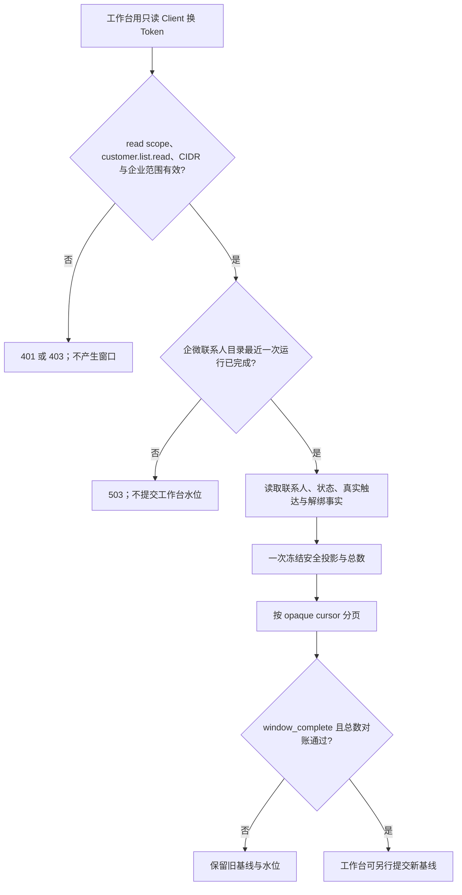

# SCRM 全联系人列表超时修复

日期：2026-09-29。范围：已授权只读 Client 的 `GET /open/v1/customers` 全量窗口建立；不改变授权、身份归属、联系人字段或发送行为。

## 业务判断与验收

2026-09-29 生产授权后实际请求 `limit=1` 在 10.02 秒返回 `503 dependency_unavailable`，request_id `8207594694189f758d2c3a15`。生产只读计划显示，现有联系人事实查询对约 23,540 条联系人逐条扫描约 5,251 条关系记录，耗时 7.48 秒、命中约 392 万缓冲页；把关系事实先按客户分组再关联的等价查询耗时 0.93 秒、命中约 25 万页。另一个风险是窗口存储逐条执行约 23,540 次 `INSERT`，需批量写入并保持原事务原子性。接口请求上限在 Composition 中固定为 10 秒；本修复不扩大超时边界。

参考：[PostgreSQL 使用 EXPLAIN 检查索引与真实计划](https://www.postgresql.org/docs/current/indexes-examine.html)；[pgx CopyFrom 批量插入实现](https://github.com/jackc/pgx/blob/master/doc.go)。复用现有 WeCom 联系人读取 Port、Archive 真实触达 Port、Open Platform 窗口 Store 与 Unit of Work，不建立新的目录、队列或身份规则。

## 方案与边界

- WeCom Owner 的 `MachineContactRows` 将关系事实按 `corp_id, customer_id` 预聚合一次，再保留原有 bound/unbound 判定和 `changed_at`/tombstone 语义。其他 Owner/标签/档案读取规则不变。
- Open Platform Owner 的 `FreezeCustomerWindow` 校验全部投影项后在现有事务里批量插入；窗口头和全部 items 必须一起提交或回滚，唯一键、24 小时到期和游标校验不变。
- 不涉及新增限制。OneID：只读取已有 canonical `customers.id`，不解析、建客或合并。Persistence：现有 PostgreSQL 本地事务的临时只读投影窗口；不新增持久任务。External Effects：无 Provider 写入和发送；触达时间仍只来自已入库的真实消息。

## 五项影响判断与验证

| 项目 | 判断 |
| --- | --- |
| 对外合同 | 路径、参数、字段、错误码与 cursor 合同不变；修复已授权大目录下的 503。 |
| 业务机制 | 关系聚合保持原状态与时间语义；窗口批量写入仍由同一 Unit of Work 原子提交。 |
| 关联模块 | `internal/wecom` 目录读取、`internal/openplatform/store` 窗口持久化，`cmd/aicrm` 列表旅程；Archive 触达读取只作回归。 |
| 页面影响 | 无页面改动；工作台在完整分页成功并对账后才能自行更新基线。 |
| 验证证据 | 现有 PostgreSQL 旅程加关系多状态/时间断言；生产量级合成窗口验证原子性、分页与耗时；`fast`、`compile`、受影响测试及准确候选影响计划。生产安装后从授权工作台出口只读验证首个全量窗口与分页计数；不展示客户明细。 |

回退由发布指挥台按原安装包处理；已冻结窗口继续遵守 24 小时有效期，失败时旧工作台水位不变。无数据库迁移，生产修复由唯一发布指挥台执行。
