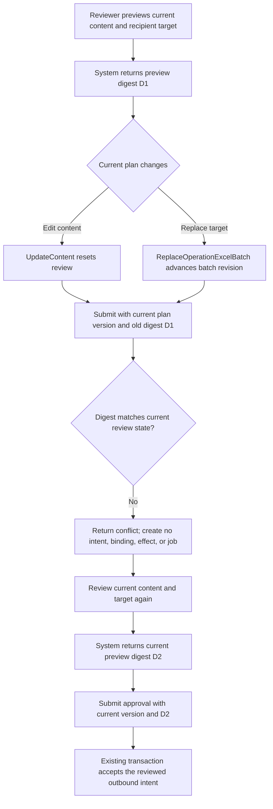

# AIREV-01: reject an approval preview after content or recipient changes

Status: authorized QA-only candidate, ported onto the cumulative staging source

Base: `e8fc9c5b25fdd5cec234c4a3a62571b8011ce6de` (`8e175d000502dba0c149286a0d9db146cb87936a`)

Scope: PostgreSQL integration regression for the existing Excel-import review and deferred-send flow.

## 1. Business decision

An approval preview authorizes the content and recipient target shown at that point. If a reviewer edits content or replaces an Excel batch with a different verified recipient target, the prior preview must no longer authorize the current plan. Submitting the earlier approval digest against the current plan version must fail before creating an outbound intent, an AI Assistant effect binding, an External Effects record/job, or a River job. The current content and target can then be reviewed again and approved using a newly computed digest.

Success criteria:

- A valid content edit after recipient review resets that recipient to pending and advances the approval version.
- Replacing the linked Excel batch through `ReplaceOperationExcelBatch` updates the persisted recipient target and batch revision through the supported application API. No direct SQL mutation is used for the target change.
- The synthetic OneID oracle resolves the newly persisted UnionID to its seeded external identity and resolves the replacement sender from the current target. The old preview digest is rejected after replacement.
- The old digest is rejected even when the request carries the current plan version, so the test reaches the digest comparison rather than only the optimistic-version guard.
- Counts for `outbound_private_message_intents`, `ai_assistant_effect_bindings`, `external_effects`, `external_effect_jobs`, and `river_job` remain unchanged by the stale submission.
- Re-review succeeds; the new digest differs; the content-edit journey keeps its existing two eligible recipients, and the replacement journey creates exactly one accepted local effect binding and EER/job set for the current target.

## 2. Reference and repository reuse

| Source | Reusable point | Decision |
| --- | --- | --- |
| [Microsoft Agent Governance Toolkit, ADR 0030](https://github.com/microsoft/agent-governance-toolkit/blob/main/docs/adr/0030-action-bound-approval-protocol.md) | The execution boundary compares the current action digest with the approved digest; changed parameters require a new decision. Its acceptance criteria explicitly invalidate approvals after target or parameter changes. | Use as an external reference for the stale-digest negative assertion. Do not import its protocol or add workflow machinery. |
| `internal/aiassistant/app/service.go` | `UpdateContent` resets reviewed deferred-target content; `approvalPreview` binds plan/recipient versions and content digest; `approvePlan` recomputes and compares the digest before saving approval. | Reuse the existing service behavior and digest contract; do not change product code. |
| `cmd/aicrm/excel_batches_integration_test.go` | Existing PG16 schema-isolated journey wires the AI Assistant repository, outbound port, External Effects repository, and River insert client, then verifies the successful two-recipient path. | Extend this journey so the negative and positive cases share the same persisted fixture and ownership boundaries. |
| P0 audit `evidence/p0-scenarios-f655-20260930/report.md` | AIREV-01 was BLOCKED specifically because old-digest submission after an edit had no assertion. | Close that named assertion; do not infer whole-scenario signoff from one test function. |

## 3. Scope and architecture classification

- OneID: no new OneID behavior. The replacement test seeds synthetic verified identities, then uses the existing OneID resolver as an independent oracle to confirm that the persisted replacement target resolves to `external-2` and the replacement sender. No identity ownership rules or matching behavior change.
- Persistence: PostgreSQL 16 integration journey with the repository's existing Unit of Work, schema-isolated fixture, and migration set.
- External Effects: in scope as an asserted boundary. The stale path must produce zero new outbound intents, business effect bindings, EER records, or jobs. The existing success path exercises acceptance through the real local EER/River repositories but starts no Provider worker and makes no external call.
- UI: no page, route, or interaction changes; no Product Design work is needed.
- Five impacts: no external contract or product behavior changes; the test covers AI Assistant review state and the existing outbound/EER acceptance boundary; the only consumer is the existing `cmd/aicrm` integration journey; no page impact; evidence is the exact-head PG16 test and repository checks.
- New restrictions: none.

## 4. Acceptance and verification

| Check | Required result |
| --- | --- |
| Existing journey before edits | Pass on cumulative base after the repository's generated source views are prepared. |
| Edited-content state | Review is pending and plan version is newer than the saved preview version. |
| Replaced-recipient state | `ReplaceOperationExcelBatch` persists the replacement UnionID/sender on the new batch revision; the existing synthetic OneID resolver returns the matching current external identity and sender. |
| Stale-digest submission | Returns `aiapp.ErrConflict` while supplying the edited plan's current version. |
| No-effect assertion | The five intent/binding/effect/job counts are identical before and after the rejected call. |
| Fresh review and approval | Re-review succeeds; current preview digest differs; current digest is accepted and existing eligible-effect assertions still pass. |
| Exact candidate checks | `python3 scripts/dev_preflight.py fast`, `python3 scripts/dev_preflight.py compile`, and the named PG16 journey on the same final HEAD/tree. Race is not required because the scenario adds no concurrency. |

All data and identities are synthetic. These automated PG16 journeys cover stale approval after content edit and after supported Excel batch recipient replacement, plus a local synthetic target-resolution oracle. They do not cover the browser journey, authenticated real-platform readback, provider delivery, or user-visible receipt. E3 24-hour endurance, 100k-customer mixed load, shared staging/production, real WeCom calls, official payment providers, and real funds remain outside this candidate. Passing local checks is partial automated evidence for AIREV-01, not full scenario or business-send acceptance.

## 5. Evidence

The initial c2cf execution logs are recorded under `.../crm-v4-qa-resume/evidence/airev01-stale-digest-c2cf-20260930/`. The ported e8fc candidate requires its own exact-head evidence. The earlier cold-checkout environment error and successful source-view preparation remain historical evidence only.
