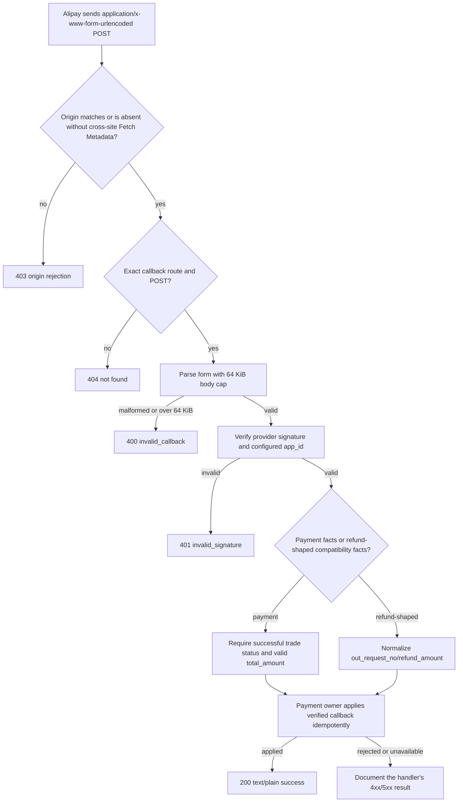

# API-CB-01 Alipay callback OpenAPI contract

Date: 2026-09-30
Status: Local candidate design; no deployment or real-provider acceptance
Base: `b5b50c2ace3e19b5aa9e23c6ab60719d6e2051c3` (`eee3e550c4c2b6ed726edc3a72e6bce7e0cebdba`)

## Business flow

The callback remains public at the HTTP-session layer because Alipay authenticates the request with its signature and the configured application ID. The outer guard rejects a nonempty `Origin` that does not match the configured public origin. When `Origin` is absent, it rejects only `Sec-Fetch-Site: cross-site`; a matching `Origin` is authoritative even if Fetch Metadata disagrees. The handler limits the encoded form body to 64 KiB and maps malformed or oversized forms to HTTP 400.

## Reference and reuse review

- Alipay's official [unified payment integration guide](https://developer.alibaba.com/docs/doc.htm?articleId=105899&docType=1&treeId=270) says the payment result is POSTed to `notify_url`, the merchant verifies `sign`, and then checks `app_id`, `out_trade_no`, `total_amount`, and `trade_status`.
- Alipay's official [trade refund API guide](https://developer.alibaba.com/docs/doc.htm?articleId=106261&docType=1&treeId=577) describes `alipay.trade.refund` as returning the refund result synchronously, with `out_trade_no` or `trade_no`, `out_request_no`, and `refund_amount`; an uncertain result is resolved with the refund query API. Alipay also documents a distinct [asynchronous refund application API](https://developer.alibaba.com/docs/api.htm?apiId=1779&docType=4). The current CRM adapter and this callback contract cover neither that separate API nor its asynchronous-result contract.
- Alipay's [older transaction notification reference](https://developer.alibaba.com/docs/doc.htm?articleId=104790&docType=1&treeId=60) documents optional legacy refund fields such as `refund_status` and `gmt_refund`. These are listed only as optional provider fields; they do not define the current unified refund result contract.
- Repository reuse: `internal/payment/http.Handler` owns the exact callback route and response, `internal/payment/provider.Alipay` owns SDK signature/app-ID verification and field normalization, and `Payment.ApplyVerifiedCallback` owns state application. `scripts/check-openapi-route-parity.mjs` is the existing place to bind custom-dispatch routes to OpenAPI. The generated Orval clients include only `HXCDashboard` and `SurveyPublic` tags, so a `Transactions` operation does not require a generated frontend-client change.

## Requirements

1. Add `POST /api/public/alipay/callback` to the canonical `api/openapi.yaml` contract with `security: []`. Explain that this means no admin session/CSRF scheme; runtime still verifies the signed Alipay form and configured `app_id`.
2. Model the required HTTP body media type as `application/x-www-form-urlencoded`, its 64 KiB encoded-body cap, and HTTP 400 for malformed or oversized forms. Represent provider values as strings and allow additional provider fields. List observed payment fields and optional refund-related fields without putting conditional/provider-version requirements in OpenAPI's `required` array. The adapter selects its refund-shaped compatibility branch from `out_request_no` or `refund_amount`; `refund_status`, `refund_fee`, and `refund_reason` are accepted but do not select or normalize a refund result, while `gmt_refund` can contribute an occurrence timestamp but does not establish a refund result. Do not present these fields as an official current async refund contract.
3. Document the exact success response (`200`, `text/plain`, `success`) and the handler's malformed/oversized parse, verification, origin, method, application-conflict, and unavailable outcomes with the shared error response where applicable. The outer guard returns 403 for a mismatched nonempty `Origin`, or for `Sec-Fetch-Site: cross-site` when `Origin` is absent.
4. Bind the exact callback path and `security: []` in route-parity validation. Keep the synthetic composed HTTP regression on the actual verifier and composition origin middleware.

## Five impact judgments

- **Public contract:** Adds a missing OpenAPI operation for an active route. Runtime callback behavior and business outcomes do not change.
- **Business mechanism:** No state model, transaction, identity, Provider, or retry behavior changes. The test proves request-boundary behavior with an in-memory application stub; existing Payment integration tests remain responsible for persistence behavior.
- **Related modules:** `api/openapi.yaml`, `internal/payment/http`, `internal/payment/provider`, `cmd/aicrm` route composition, and the OpenAPI route-parity script.
- **Page impact:** None. No sidebar, H5, or admin UI behavior changes.
- **Evidence:** OpenAPI validation, custom route-parity check, composed synthetic signed HTTP regression, fast preflight, relevant Go package tests, and affected-plan dry-run. No real funds, Alipay credentials, staging install, production readback, or paused E3 24-hour/100k-customer load is included.

## Shared-boundary classification

- **OneID:** Not involved. The callback resolves a known Payment by the merchant order reference; it does not create, match, or merge a customer identity.
- **Persistence:** The production handler delegates verified facts to Payment's existing application and transaction boundary. This contract-only candidate adds no tables or durable jobs.
- **External Effects:** No new Provider write, queue, retry loop, effect state machine, or reconciliation rule. Alipay's incoming signed notification is verified input; the current CRM adapter uses the synchronous refund API and refund query. The separate asynchronous refund application API and any related result/callback contract are outside this candidate.
- **Limits:** 不涉及新增限制。 Existing signature and app-ID checks remain mandatory.

## Acceptance and rollback

Accept when a signed synthetic payment callback and refund-shaped compatibility callback receive the documented acknowledgement through the composed route; a matching `Origin` proceeds even when Fetch Metadata says cross-site; a wrong app, tampered form, malformed form, body over 64 KiB, foreign origin, cross-site metadata without `Origin`, and wrong method return their documented status without applying unintended business state; no admin session/CSRF path is called; route parity rejects omission of the operation; and the OpenAPI document validates.

Rollback consists of reverting the operation and its parity/test additions together. This does not alter Payment records or provider configuration.
