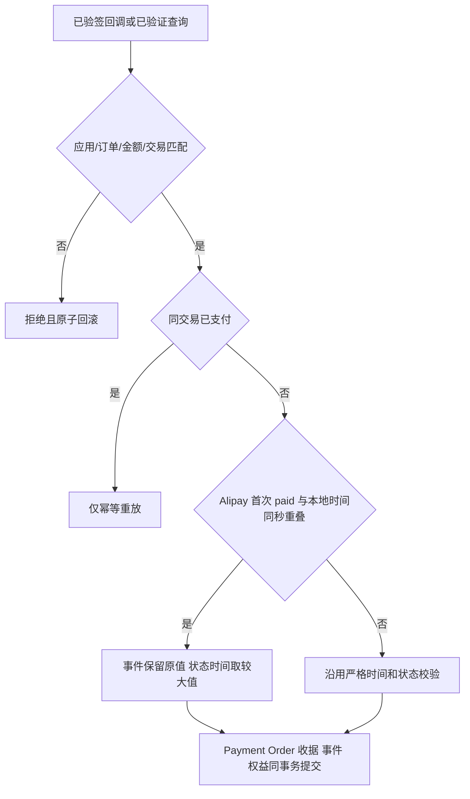

# Alipay 同秒付款确认

## 问题与目标

L40 `78efa522` / L10 `ba75230` 已复现：合法签名的支付宝秒时间早于本地同秒微秒 `Payment.updated_at` 时，付款确认返回 409，订单保持未付款。下一秒通知可成功。目标是让这个有效同秒事实成功结算一次，同时保留原 Provider 事件时间和单调的本地状态时间。

## 参考与复用

- [支付宝官方 SDK](https://github.com/alipay/alipay-sdk-java-all)：继续使用当前 SDK 验签。
- [阿里官方托管异步通知说明](https://jaq-doc.alibaba.com/docs/doc.htm?articleId=105301&docType=1&source=search&treeId=204)：历史文档区分秒精度通知时间和付款时间。
- [Alipay+ 官方相关 API](https://docs.alipayplus.com/alipayplus/alipayplus/global/spot_pay)：秒精度事件字段的相关案例。

复用 Payment/Order 状态机、现有行锁/CAS/UoW、幂等收据、paid event、权益和派生消费者。`notify_time` fallback 是通知时刻，不冒称付款发生时刻；原始验签字段与摘要不改写。

## 范围及边界

专门的已验证 Alipay 首次付款方法允许事件和本地更新时间位于同一 UTC 秒；早一整秒仍拒绝。通用支付/订单结算与退款时间规则不变。Payment `paid_confirmed_at`、订单历史/paid事件与权益使用原事件；Payment/Order `updated_at` 不回退。backfill 重构快照对 Alipay 创建同秒精度重叠保持有效，原事件不变。

OneID：只沿用订单既定客户，不解析/合并身份。Persistence：现有单一 PostgreSQL UoW。External Effects：回调与 Provider 只读查询，不增加资金调用或任务机制。不涉及新增业务限制；仅准确解释已有 Provider 精度边界。无数据库迁移、UI 代码或交互变更。

五项影响：有效同秒通知由409改为200；首次付款时间表达分离；关联Payment/Order/Coupon/服务期/分销推广消费者；支付页轮询结果受影响；验证须有签名HTTP与PG读回、完整相关模块和回滚证明。没有真实支付或生产验收声明。

## 验证及回退

确定性 fail-first：callback/query 同秒失败，对照早一秒拒绝和下一秒成功。修复覆盖原时间保留、版本与唯一事件、签名/金额/app/订单反例、Order较晚时回滚、派生事件失败整体回滚、重复/新通知/查询前后顺序、服务期权益与backfill。重跑退款、WeChat和缺失历史确认时间恢复合同。

只本地提交供审查；发布由唯一工作台在最终累计基线执行。代码回退不删除已有资金事实、收据或重发资金效果。seller_id与退款时间字段选择属于独立问题，本候选不处理。
