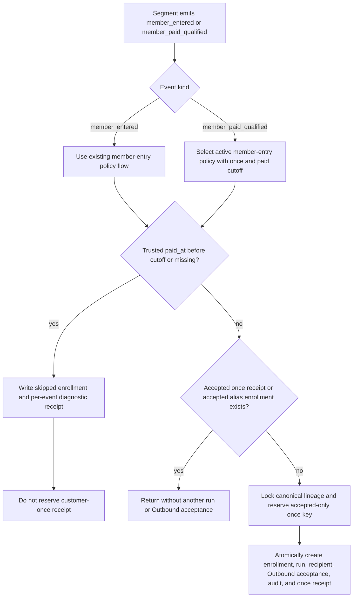

# Paid-qualified member events: historical deferral and one accepted trigger

Parent brief: `2026-09-30-paid-audience-identity-auto-send-closure.md`. Business rule: each paid order qualifies only when the payer is already a HuangYouCan/staff10 WeCom friend at that order's payment time. An earlier unqualified payment does not block a later qualifying payment. Existing qualified members from the authorized OneID merges remain in package #27, but pre-cutoff paid facts do not receive a historical welcome send. A later qualifying payment at/after the cutoff may trigger the existing active policy once for that canonical customer.

This Automation change adds policy-scoped historical deferral and `once_per_customer` opt-in, plus an explicit consumer for the distinct paid-qualified Segment event. It does not change ordinary policies' reentry behavior.

## Business flow

## Boundaries and reuse

- OneID: consume canonical `CustomerID` from Segment and use `LockedCanonicalLineageReader` in the final Automation UoW. Check accepted receipts/enrollments across every alias; reserve the accepted-once key under the current canonical root. Automation does not match identities, provision customers, merge roots, or access Identity tables.
- Persistence: reuse Automation runtime receipts and enrollment snapshots. Historical cutoff/list skips have per-event terminal diagnostic receipts but never reserve or complete a customer-once receipt. New accepted-once reservations use a separate operation namespace; legacy receipts with `enrolled`/`prior_enrollment` remain blocking, while legacy `deferred` receipts do not. No table or migration is added.
- External Effects: only an eligible, once-unconsumed enrollment reaches the existing transactional Outbound acceptance port. Final enrollment, accepted-once receipt, audit, run, and Outbound intent acceptance share the UoW; no Provider network call runs while the lineage lock is held.
- Page/API: no UI or request/response shape change. The existing policy `action_config` object accepts optional backend fields. Active policy versioning remains atomic and keeps the policy active.
- References and reuse: reuse the parent brief's Segment-to-Automation and OneID contracts, current immutable policy-version API, runtime receipts, Outbound port, and External Effects acceptance boundary; do not copy the archived CRM implementation.
- Restrictions: no new ID-count cap; existing request-body limit remains the transport boundary. Once-only behavior is opt-in because other policies must retain their existing reentry semantics.

## Contract and acceptance

1. Outbound `action_config` supports optional `deferred_customer_ids`, `defer_before_paid_at`, and `once_per_customer`. IDs are positive, unique, sorted in canonical config, and have no additional list-size limit. A timestamp cutoff is normalized to UTC and requires `once_per_customer: true`. An active policy update may only add deferred IDs, set the cutoff once, and enable once-only; it cannot remove IDs, change an existing cutoff, or disable once-only.
2. `MemberEnteredV1` retains its EventID-based source digest. Its optional `PaidOrderID` and `PaidAt` facts are either both nil (legacy event; old JSON/hash behavior remains unchanged) or a valid pair. Paid-qualified events and opt-in member-entered events with paid facts also get a same-UoW `member_event_source_facts_v1` receipt keyed by event kind plus EventID; its payload digest binds package, snapshot, configuration, canonical customer, order, and paid time. Reusing an EventID with changed facts conflicts even after a policy version change. Legacy member-entered events with no paid facts do not get re-keyed.
3. Existing members whose latest qualifying `(PaidAt, PaidOrderID)` fact advances receive the separate durable `audience.member_paid_qualified.v1` contract (`MemberPaidQualifiedV1`). It contains the event kind, order ID, and paid time, has a source-key namespace distinct from member-entered, and is sent through the existing Segment event queue. It is not synthesized as a fake member-entered event and does not change `entered_at`.
4. The explicit Automation paid-qualified entry handles only active `audience.member_entered.v1` outbound policies with both `once_per_customer: true` and `defer_before_paid_at`. If no such policy is active, it returns retryable not-ready; it must not write a terminal `no_active_policy` receipt. Member-entered continues its existing no-policy receipt contract.
5. `PaidAt < defer_before_paid_at` skips that event; a missing/zero paid time also fails closed. Equality with the cutoff is eligible. These event-level skips create a skipped enrollment, immutable source/deferred receipts, and a readable diagnostic, with no run, recipient, Outbound/EER acceptance, or customer-once receipt.
6. A later distinct paid-qualified event with trusted `PaidAt >= cutoff` can trigger after an earlier historical or missing-time skip. Skips do not consume the customer-once slot. Once an enrollment is accepted by Outbound, later reentry, new event IDs, policy versions, or customer-root changes cannot send again. Accepted legacy alias enrollment/receipt prevents repeat; a prior skipped enrollment or legacy `deferred` receipt does not.
7. Under concurrency, distinct EventIDs for aliases of one canonical customer lock/read the same lineage and reserve the same accepted-only root key. The unique receipt reservation lets at most one UoW create the accepted enrollment/Outbound intent. A failed UoW leaves neither a once receipt nor an enrollment/effect, so the durable event can retry.
8. Do not configure a broad static list of all prior buyers or all 88 contact survivors: that would suppress later genuinely qualifying payments. Use the trusted paid-time cutoff for historical deferral. The optional explicit ID list remains for narrowly reviewed cases only.

## Cutover sequence and readback

1. While package #27 and policy #1 are active, atomically version policy #1 to add `once_per_customer: true` and the approved `defer_before_paid_at` cutoff. Read back lifecycle, current version, cutoff, once flag, agent, quiet hours, run limit, and approver. The paid-qualified event path stays retryable until this opted-in version is active.
2. Drain/check in-flight member-event UoWs and Outbound acceptance; the policy row lock makes an old-version final UoW either commit before the active-version swap or retry against the new version. Do not pause the policy, which could create terminal no-policy receipts.
3. Only after Automation deferral is active, pause package scheduling if needed, update the friend-at-payment filter, reactivate, then run the controlled refresh. Package pause does not block manual refresh; prohibit and drain parallel refreshes during the window. The Segment refresh must emit the new paid-qualified fact when an existing member's latest qualifying order advances, even if the member-ID set is unchanged.
4. Read back the active friend rule, package snapshot/member delta, member-entered and paid-qualified event counts, immutable source-fact receipts, per-event skip diagnostics, accepted-only once receipts, enrollments, runs/recipients, Outbound intents, and External Effects receipts. Verify pre-cutoff and missing-time events skip without spending once; a later eligible paid order for that customer is accepted once; replay, changed-fact replay, reentry, alias-root change, and concurrent alias events do not create another acceptance.

This candidate changes code and documents only. It does not configure production, send messages, or confirm any OneID merge. Production ID sets must not include all historical buyers or all candidate survivors; production configuration, merge authorization, provider acceptance, and business readback remain separate steps.
