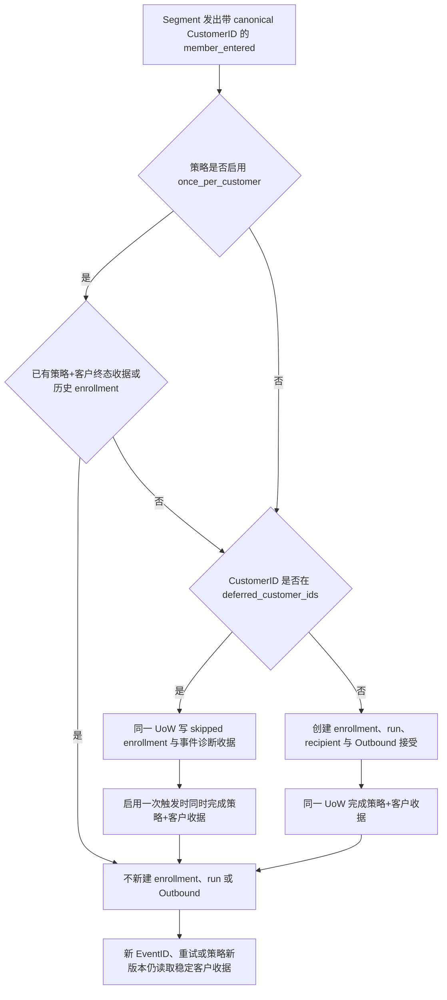

# 人群包跨根合并后的历史欢迎发送暂缓与策略级一次触发

父 brief：`2026-09-30-paid-audience-identity-auto-send-closure.md`。当前切换口径：88 对中首次目标商品付款时已满足指定 HuangYouCan 好友资格的 46 个历史客户保留在人群包，但不补发历史欢迎话术。本候选为显式选择的合并后客户增加持久欢迎发送暂缓，并让策略对每个 canonical Customer 最多接受一次入组/欢迎发送。暂缓名单、首次付款 cutoff 和一次触发都是 `outbound_message.action_config` 的可选策略设置；没有 `once_per_customer: true` 的其他策略保持原有重入语义。

## 业务流程

## 复用与分类

- 参考并复用父 brief 的 OneID、Segment 首入和自动话术行为合同；不复制旧仓实现。
- OneID：读取 Segment 事件提供的 immutable `CustomerID`，并在 Automation 最终 UoW 通过 `LockedCanonicalLineageReader` 锁定当前 canonical root 与全部历史 alias。客户级一次收据以当前 root 为键，同时检查 lineage 中任意 alias 的既有收据和 enrollment；root 后续变化不会绕开历史消费记录。`FirstPaidAt` 由可信 paid-order 事实源汇总整个 Identity lineage；不做身份匹配、建客或合并。
- Persistence：在 Automation 最终入组 UoW 内复用 `automation_runtime_operation_receipts`，以策略 ID + canonical CustomerID 派生稳定键。它与 enrollment、audit/Outbox 及 Outbound 接受一起提交或回滚；首次读取到该策略任何版本的旧 enrollment 时，会在跳过新入组的同一事务内补全一次收据。无新表或迁移。
- External Effects：暂缓客户不调用 Outbound/EER。一次触发未消费的新客户沿用既有 Outbound Port；Provider 执行不持有 Automation 数据库锁。
- 页面影响：无。使用现有受保护策略 PATCH API；`action_config` 已是开放对象，不增加对外接口形状或 OpenAPI 示例。
- 参考调研：父 brief 已记录旧 AI-CRM 的身份桥接、分群刷新和自动化绑定案例；V4 的不可变策略版本、runtime receipt、OneID Port 与 External Effects Port 是本次边界。
- 限制必要性：客户级一次触发是已明确的“商品只按首次购买触发”业务规则；将其设为显式 opt-in，只允许活动策略从 false 单向启用，避免改变其他策略重入。历史暂缓名单不设额外条数限制，沿用策略 API 的 128 KiB 请求边界。

## 本次范围与验收

1. `outbound_message.action_config` 接收可选 `deferred_customer_ids`、`defer_before_first_paid_at` 和 `once_per_customer`。Customer ID 必须为正数且名单无重复；名单按升序规范化后参与版本摘要。时间 cutoff 为规范化 UTC 的可信 timestamp，必须与 `once_per_customer: true` 同时配置。没有该 opt-in 时不改变原有策略行为。
2. Segment 的 `MemberEnteredV1.FirstPaidAt *time.Time` 由可信付款事实源按完整 OneID lineage 提供目标商品首次 `paid_at`，并随 immutable entered event 持久化/读回。`FirstPaidAt < defer_before_first_paid_at` 时 skip；等于或晚于 cutoff 正常处理。cutoff 启用但事件缺时间/时间为零时 fail closed，留下 `first_paid_at_missing_deferred` skip 及终态收据，禁止用 event/snapshot/sync time 猜测。
3. 活动策略只有在其余字段不变时才能追加暂缓 ID、单向添加 cutoff，并可从 `once_per_customer: false` 单向启用为 `true`；不得删除已有 ID、修改已配置 cutoff 或关闭一次触发。原活动版本行的最终共享锁保证并发成员事件要么在版本替换前提交，要么在重试后读到新版本。
4. 一次触发收据按策略 ID + 当前 canonical CustomerID 唯一，跨 EventID、Segment snapshot 和策略版本有效。最终 UoW 锁定完整 Identity lineage 后，会检查每个 alias 的既有客户收据及历史 enrollment；首次消费后再合并到新的 survivor root，仍能从 alias 找回原收据。第一次命中 ID/cutoff/缺失时间暂缓时，`skipped` enrollment、事件诊断收据和客户级终态收据在同一 UoW 提交；第一次正常触发时，enrollment、run/recipient、Outbound 接受、审计与客户级收据在同一 UoW 提交。失败回滚后可安全重试。
5. 开启一次触发时，如客户在该策略任一版本已存在 enrollment，则新版本不重复创建 run/Outbound，并在同一事务补全客户级消费收据。这覆盖策略切换前已提交的旧版本事件；切换中的旧事件由活动策略行锁确保提交或重试，不会静默落入无策略窗口。
6. 名单按首次目标商品付款时的好友资格和 canonical payer-root 重算，不能沿用旧的 253 根超集。静态名单无法覆盖筛选时尚未入账、上线后才回填的历史首购记录，因此 cutoff 必须作用于事件所带可信 `FirstPaidAt`；这 46 位首购时合格的历史客户保留为包成员但由 Automation cutoff 暂缓发送。首购时不是指定员工有效好友的客户以后加好友或复购也不改变首次资格。
7. 列表命中记录 `historical_identity_merge_deferred`；首购早于 cutoff 记录 `historical_first_paid_before_cutoff`；cutoff 开启而事件时间缺失记录 `first_paid_at_missing_deferred`。这三种情况均不建 run、recipient 或 Outbound。已消费的一次触发客户后来离包再入、换 EventID 或跨策略版本重放时不再发送；未启用该选项的策略不受影响。
8. 无活动策略时既有 `no_active_policy` 终态收据语义不变；不暂停生产策略，不新增无策略丢事件窗口。

## 部署顺序与读回

1. 在合并前重新计算并读回有证据支持的 defer Customer ID；更新活动策略时原子追加名单、配置冻结 cutoff 并启用 `once_per_customer`。当前 ready 配置需通过原策略预检；读回策略仍 active、字段未变、名单摘要准确。
2. 等待/核对已开始的成员事件事务与 Outbound 接受结果。策略版本替换的行锁只等待最终入组 UoW；它不撤回已被 Outbound/EER 接受的效果。按原幂等键检查旧版本 enrollment/run/intent/effect，不能把“排队”当作送达。
3. 如 Segment 规则需要暂停包以改配置，只暂停包的定时评估，保持策略 active；暂停包不阻止手动/入站 refresh，发布窗口必须禁止并排空它们。更新首次付款时好友资格规则，不用 paid_at cutoff 排除 46 位合格历史包成员；重新激活包后执行受控 refresh。Segment 事件中的可信 `FirstPaidAt` 与 Automation cutoff 负责晚到历史免发。
4. 读回 active owner 资格、46 位历史合格成员仍保留、snapshot 成员差、唯一 entered 事件、客户级收据、enrollment/run/recipient/Outbound/EER 差。验证一个 cutoff 后首次付款正常触发；cutoff 前历史及晚到入账记录保留入包但只写 skip/收据；同客户离包重入仍不产生第二次策略收据或效果。缺少可信 `FirstPaidAt` 的旧事件只能按 fail-closed 诊断跳过。

此候选不写生产 ID 清单、不确认 OneID 合并、不执行配置或发送。生产配置、首次购买资格和真实外部效果由发布指挥台与业务读回分别确认。
