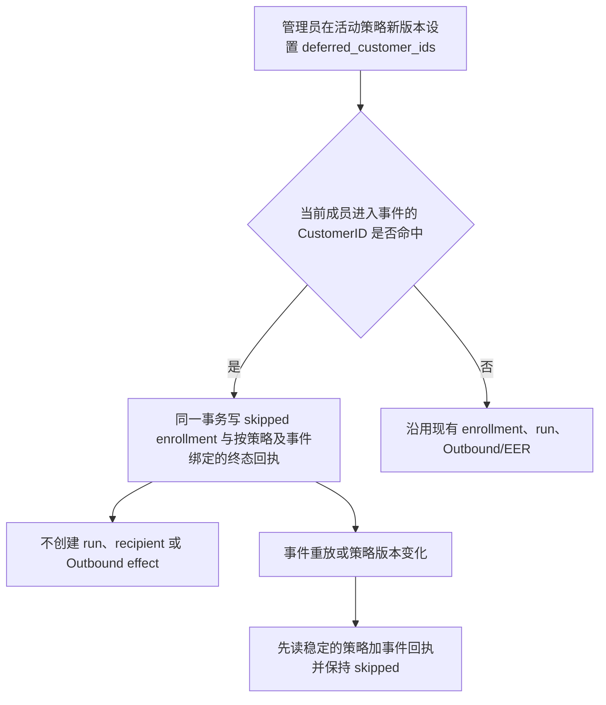

# 人群包跨根合并后的按客户持续欢迎发送暂缓

父 brief：`2026-09-30-paid-audience-identity-auto-send-closure.md`。本次为已审阅合并根增加按 Customer ID 持续生效的自动欢迎发送暂缓；名单内客户后续再次进入人群包时仍会跳过，包 #27 的活动策略继续接收名单外真实新付费成员。

## 业务流程

## 复用与分类

- 参考并复用父 brief 的身份、分群、策略、外部效果行为合同；不复制旧仓实现。
- OneID：读取合并后由 Segment 事件携带的 canonical `CustomerID`；不做匹配、建客或合并。
- Persistence：Automation UoW 内原子写现有 append-only `automation_enrollments`、运行审计/Outbox 与 `automation_runtime_operation_receipts`。终态抑制回执按稳定 `policy_id + event_digest` 唯一化，不含客户 ID 或原始 Segment event ID。
- External Effects：命中暂缓集合时不调用 Outbound/EER；其他事件维持既有流程。
- 页面影响：无。现有受保护策略 PATCH API 更新活动策略版本；不新增页面。
- 参考检索：父 brief 已记录旧 AI-CRM 的 `IdentityBridge`、人群刷新与自动化绑定行为；当前 V4 的不可变策略版本、幂等入组、OneID Port 和 External Effects Port 是实现边界。

## 本次范围与验收

1. `outbound_message` 的 `action_config` 接收可选 `deferred_customer_ids`；正数、无重复，按升序规范化后参与版本摘要。部署 ID 集必须在“目标商品支付时已为指定 HuangYouCan 员工的有效好友”的历史资格规则与 OneID payer-root canonical join 定稿后重算，不能直接使用当前 253 根超集。只放入有可信支付时间、可信好友创建时间且 cutoff 前已满足包资格的历史根，以及这些根合并后实际会入包的联系人保留根；Customer ID 不进入源码。
2. 活动策略可在保留 `active` 生命周期时 CAS 更新到带暂缓清单的新版本；只允许在其他策略字段不变时追加暂缓 ID，正常话术与发送人就绪检查继续生效。策略行锁与最终成员事件读锁排序：事件要么在版本替换前完整提交，要么读到新版本并重试，不会以旧快照静默丢弃新付款事件。
3. 命中 ID 时留下 `skipped` enrollment，快照说明 `historical_identity_merge_deferred`，并写跨策略版本稳定的事件终态回执；不建运行或外部效果。
4. 未命中 ID 的新付款事件保持正常自动化；同一已暂缓事件跨重试和后续策略版本重放仍不能发送。
5. 无活动策略时已有 no-policy receipt 语义不变。
6. 当前 ID 暂缓是针对所列 Customer 在策略下的所有 `member_entered` 事件；如果某根以后离包再重新入包，仍会被暂缓。若业务要求只跳过首个历史合并事件、同时允许同一根未来重新入包，则需另加原子的一次性 customer-policy 暂缓占位与并发锁，不能用静态 CustomerID 名单冒充一次性处理。

不涉及新增身份规则、队列、表、迁移、Provider writer 或 UI；不新增 ID 数量上限，沿用现有受保护策略 API 的 128 KiB 请求体边界。身份范围复用 OneID canonical Customer。

## 部署顺序约束

先依据时间资格和 OneID canonical payer join 重算并读回暂缓 ID 集，在合并前对活动策略执行单次原子版本更新，并读回确认生命周期仍为 `active`、清单摘要准确、策略其余字段未变；确认后再执行 OneID 合并。版本替换会等待已取得旧版本行共享锁的成员事件事务提交，因此部署前还需核对这些 ID 是否已有旧版本入组或 Outbound/EER 已接受记录。已接受的外部效果由既有 Outbound/EER 生命周期继续处理，清单更新不会撤回它们。版本切换本身不暂停策略、不产生 no-policy receipt，也不调用 Provider。
