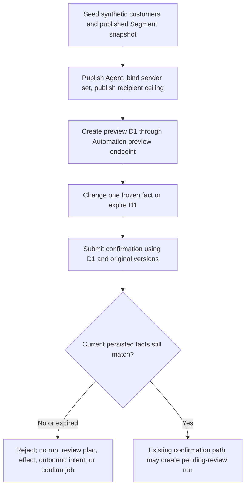

# AUTO-02: frozen preview confirmation readback

## Scope

Test-only candidate based on the local AIREV-01 cumulative candidate `b5b50c2ace3e19b5aa9e23c6ab60719d6e2051c3`. Verify one Automation preview remains bound to its persisted snapshot, package and Agent versions, sender assignment, recipient ceiling, and expiry through the real preview-to-confirm application path. Each stale-confirm branch must leave PostgreSQL run/review/effect/job state unchanged. No product code, schema, API contract, UI, Provider configuration, or new limit is proposed.

## Business flow

The test focuses on six independent stale branches in one fresh PG16 schema: expired preview; stale package version; changed published snapshot; changed Agent published version; changed sender identity; and a recipient ceiling lowered after preview. It also exercises the supported `PutBinding` mutation, which advances both package and binding versions before the old preview is rejected. That composite path is recorded as REVIEW for the independent binding-version guard because it does not isolate that guard. Each result is recorded separately and compared against pre/post authoritative rows. The test does not approve or execute any plan.

## Reuse and reference

- Reuse the baseline `RuntimeService.CreateBroadcastPreview` / `ConfirmRun`, `RuntimeHandler`, the Segment execution/snapshot services, the existing Automation/Ai Assistant PostgreSQL stores, and the current integration fixture helpers.
- The external design reference is Microsoft's accepted [ADR 0030: Action-Bound, Fail-Closed Approval Protocol](https://github.com/microsoft/agent-governance-toolkit/blob/main/docs/adr/0030-action-bound-approval-protocol.md). Its transferable principle is to bind approval to the reviewed action and relevant versions and reject stale/expired approval before execution. It is a comparison, not a new dependency or a change to CRM policy.
- The local static/runtime source review confirms preview digest inputs include snapshot, package, Agent, binding, sender-set, runtime-config revision, and recipient ceiling; confirmation re-reads persisted Segment and config state before creating a plan/run.

## Classification and acceptance

- OneID: synthetic canonical customer records provide snapshot members; no identity resolution, provisioning, or ownership change is exercised.
- Persistence: real PostgreSQL 16 stores and existing Unit of Work; independent SQL readback before and after each confirmation.
- External Effects: no worker or real Provider is started. Stale confirmation must not create a review plan, outbound intent, External Effects row, or River job.
- Acceptance: each case records preview IDs/digest/versions, supported mutation or expiry setup, HTTP status, and an independent persisted-state equality oracle. The six independent stale axes are assessed separately; independent binding-only guard remains REVIEW because supported `PutBinding` advances package and binding versions together. Unit-test PASS is related context only and does not sign off AUTO-02.
- UI: no UI code or browser behavior changes.
- New limits: not applicable; the test uses synthetic values within existing configured bounds.
