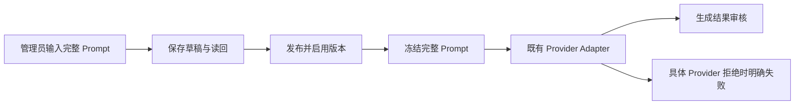

# L10：Agent Prompt 全链长度减法

父 PRD：`/Users/qianlan/Documents/Codex/2026-09-29/crm-v4-qa-resume/repo-out/prompt-limit-removal-brief-20260930.md`。沿用其授权、参考和业务判断。本候选不涉及新增限制。

参考：[PostgreSQL text](https://www.postgresql.org/docs/16/datatype-character.html)、[Go net/http](https://pkg.go.dev/net/http)。复用现有 Agent 生命周期、Automation UoW/生成记录、PublishedGeneration、External Effects 和 Provider Adapter。

## 影响

- 对外合同：移除两个 Prompt 的20,000字符保存限制和16,000字节生成限制，同步OpenAPI和已有生成类型。空草稿仍允许；生成仍须非空、有效Agent及发布版本。原首尾空白校验保留。
- 业务机制：Automation所有的草稿、发布与冻结生成项保持原事务。0212前向迁移只放宽两个CHECK，保留非空且不改历史数据，不做反向收紧。
- OneID：只沿用既有canonical Customer上下文读取，不新增身份解析/建客；External Effects沿用既有冻结、幂等和执行路径，不新增队列或Provider写入入口。
- 关联模块：Automation app/port/store、OpenAPI及来源index/lock、已登记Agent页面、生成类型。GenerationContext的问卷/聊天/标签/激活16k和生成输出限制属于不同合同，本候选不变更。
- 页面：真实入口`/admin/agentEdit.html`经现有controller/template，两个Prompt textarea本来没有maxlength；新增真实浏览器长Prompt保存/刷新/发布/服务端读回。未挂载的`sections/automationAgents.ts`按父任务要求仅移除两处旧maxlength，防止未来重挂载恢复旧限制；未改变视觉样式。
- Product Design：已读取index、user-context/get-context并执行preflight，明确现有页面为目标；本轮合成浏览器截图已采集和打开。截图来自仓库既有Chromium/CDP验收，未通过插件指定IAB交互捕获，因此不宣称完整Product Design视觉审计。新页面/新视觉探索不涉及。

## 验证与边界

私有PG16测试覆盖ASCII、CJK、emoji超过旧阈值的HTTP创建/更新、发布/激活、HTTP和SQL字节相等、PublishedGeneration、冻结generation item、dispatch及loopback Provider完整system/user序列，Provider HTTP拒绝保持明确失败。负向校验包含空冻结Prompt、错误发布版本；现有模块全集继续覆盖授权、重复/取消、版本变化和客户隔离。真实页面使用原登录/session/CSRF，输入长Prompt后保存、刷新、发布并服务端精确读回。

L40负责完整HTTP body解析；在合入L40前，本候选使用各自小于128KiB的独立字段PATCH，不能将此称为大于128KiB的单请求验收。最终组合请求须在L40累计基线重验。真实Provider/资金、Linux受信任检查、共享预发和生产均由发布工作台另验，E3负载/长稳暂停。
