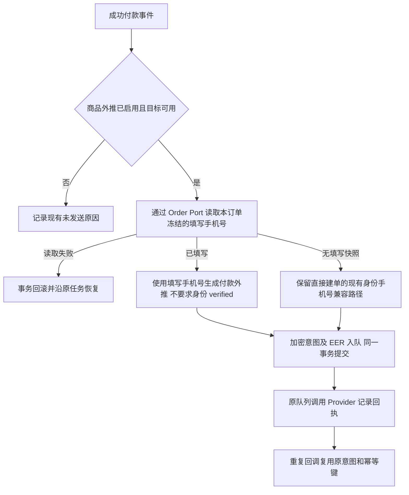

# 付款商品外推使用用户填写手机号

用户已授权修复并完成到预发布；生产晋级及历史补推不属于本次范围。

## 依据及方案

生产商品 20 的订单 930/932/969/1080 均有 order_contact_snapshots，但用户填写手机号仅为 declared；旧 paidPayload 在读取订单联系方式前就要求 verified 身份，生成 planned_identity_unavailable，实际调用为零。

市场参考：[Stripe 电话收集](https://docs.stripe.com/payments/checkout/phone-numbers)将结账收集的联系方式与身份认证分开。此参考用于边界判断；发送规则由用户本次明确指令决定。复用本仓 Order.CheckoutMobileReader、ContactCipher、已接入的 SetFieldMappingReaders、CommercePushService 和 EER，无需新增身份匹配器、队列、迁移或页面。

采用本订单填写快照优先的方案，优于放宽全局 VerifiedOutboundPhone（影响其他 Provider）或读取客户最新 declared 手机（可能与本订单填写内容不同）。冻结手机号作为 beneficiary 的 phone_number；付款者与受益人为同一客户时，同时作为 buyer.phone。不同付款者的 buyer.phone 保留其自己的可用身份手机号，缺失不阻断已填写的订单联系方式，不把受益人手机号冒作付款者身份。订单未填写手机号时保留既有直接建单兼容行为。手机号仍是用户填写事实，不提升 assurance。

## 影响与验收

- 对外合同：transaction.paid 字段和签名不变；已填写手机号的付款订单可正常接受外推。
- 业务机制：只变更外推载荷的手机号来源优先级。Order/Payment/Outbound/EER 原事务及幂等不变；不重建历史意图、不补推退款单。
- OneID：读取已有 canonical customer 和其外部身份，不新增绑定、合并或验证。
- Persistence/External Effects：沿用加密意图、审计/outbox、EER/River，同一 PostgreSQL UoW；Provider 调用在事务外。
- 关联模块：outbound 载荷、Order 联系方式 Port 和付款回调合同；页面无修改，现有后台回执用于读回。
- 不涉及新增限制；复用订单联系方式已校验格式及现有隐私保护。
- 验证：填写手机号且没有 verified 身份；填写快照优先于客户身份；不同付款者；不存在快照的兼容；读取失败；实际 Provider 合成调用及回执；重复回调和任务重放只发送一次；不改变 declared assurance、不泄漏原文手机号到 EER/队列审计。
- 发布：准确候选和证据交唯一发布工作台，沿当前累计预发基线验证；仅预发安装和合成合同，真实生产 Provider 未验证。回退沿发布工作台既有应用包回退路径。
