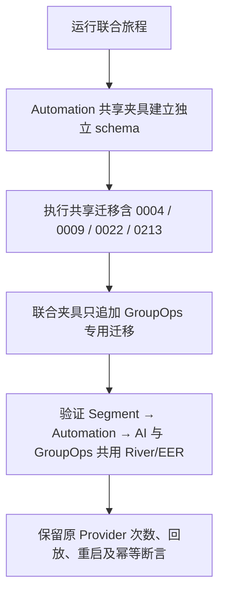

# Automation / AI / GroupOps 联合旅程迁移夹具修复

## 业务判断与目标

COUP04 检查的宿主测试在业务断言之前失败。准确基线为 `05112adc776669194d378c1136ac687019789853` / tree `c3142bc70fc30a4517826f5d7f6bc68125359ef0`。在独立 PostgreSQL 16.13 数据库重现 `TestAutomationAIAssistantAndGroupOpsShareRiverRuntime`：联合夹具重复执行 `0004_wecom.sql`，返回 `wecom_oauth_states already exists` / SQLSTATE 42P07。

## 参考与复用

参考 [PostgreSQL 16 CREATE TABLE](https://www.postgresql.org/docs/16/sql-createtable.html)：同 schema 的关系名必须唯一；`IF NOT EXISTS` 不保证既有关系结构与目标一致。复用仓库 `automationAudienceRuntimePool` 的既有完整初始化，联合夹具只追加自己的迁移。不引入忽略 SQL 错误、删表重建或修改生产 SQL 的绕过路径。

## 范围与验收

仅移除联合旅程追加列表中已经由 helper 应用的 `0004_wecom.sql`、`0009_customer_activation.sql`、`0022_customer_profile_sections.sql`，说明共享迁移的归属。生产迁移、业务代码和旅程断言均保持原样。OneID 不涉及行为变化；Persistence 只涉及合成测试 schema 的初始化顺序；External Effects 仍为现有模拟 Provider 合同。不涉及新增限制或 UI 能力。

五项影响：对外 API/事件/错误合同无变化；业务机制无变化；关联模块仅 `cmd/aicrm` 测试夹具；页面与交互无变化；验证采用 fast、compile、准确 affected 计划与联合旅程及共享夹具调用方测试，缺少的 Linux/浏览器验收明确交付给父任务。

保留基线首次测试失败和 SQL/schema 证据于 `/tmp/aicrm-joint-fixture-base051-evidence`。验收要求联合旅程完成全部原有断言、共享 helper 调用方继续通过；恢复本改动即恢复原测试夹具，不涉及生产数据回滚。本候选由父任务整合，不单独推送或安装共享环境。
