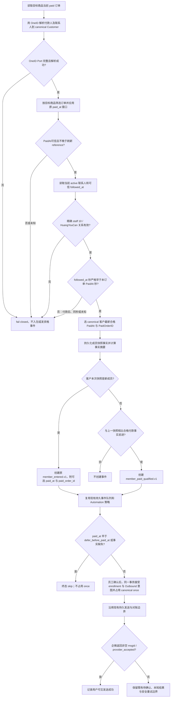

# 人群包 #27：付款时已是黄有璨企微好友

## 本次规则

只对显式 opt-in 的 `paid_order` 人群包生效；包 #27 的商品 `334465678` 使用此规则。判断单位是当前状态为 paid 的目标商品订单：付款时客户已经是指定黄有璨企微账号（Access staff ID `10` 映射出的精确 provider userid）的有效外部联系人，该订单才是合格付款。付款后加好友不会回头使旧订单合格；之后若客户已有该好友关系并发生新的 paid 订单，新订单可以使客户进入包或产生新的合格付款事件。对同一个 canonical OneID 客户，只有最新合格 `(PaidAt, PaidOrderID)` 前进时产生事件；历史抑制不占用 once，Automation 在同一事务接受 enrollment 与 Outbound 意图时占用 `once_per_customer`。用户可见的发送成功边界仍是企微返回非空 `msgid` 并记录 `provider_accepted`。

## 合同与数据边界

- 只在后端显式 opt-in；#27 继续 `owner_scope=all`。不能改用 `owner_scope=specified` 过滤好友，因为订单的 immutable `OwnerReference` 可能为空。精确好友 owner 单独通过 `friend_owner_staff_ids=["10"]` 经 Access Owner Port 解析，不按显示名猜测。
- opt-in 订单按付款人及当前联系人 OneID canonical root 做 join。canonical resolver 缺失、报错或返回数量不完整时 fail closed；不 opt-in 的旧 `paid_order` 路径保留原筛选与 ID 输出语义。
- `PaidAudienceOrders` 只返回当前 `status='paid'` 的目标订单；必须有可信 `PaidAt` 且 `PaidAt <= refresh reference`。每个订单分别比较好友加入时间。企微 `createtime`/验签回调 `CreateTime` 只有秒精度，只有 `followed_at.Unix() < PaidAt.Unix()` 才算付款前好友；同秒排除。某个客户至少一笔订单合格即留在当前快照，事件事实选择其中 `(PaidAt, PaidOrderID)` 最大者。付款后添加好友不使原订单合格，但之后新 paid 订单可以合格。
- 联系人必须处于当前 active 关系并且 owner 精确匹配 HuangYouCan。仅 Provider `createtime` 或经过验签且证明当前 active 联系人的新增回调可写 `followed_at`；`ObservedAt`/本地创建时间不可信。edit 保留、delete 清空、re-add 写新时间，乱序旧回调不能复活已删除关系。未知时间 fail closed。
- Segment snapshot 成员事实为 `PaidAt` + `PaidOrderID`。同批重试将两值一同纳入 digest；相同 run/ordinal 的事实改变返回冲突。新成员的 `member_entered.v1` 保留旧 ID 差集语义，opt-in 时可带同一对付款事实；老/非 opt-in 事件为 NULL 且旧 digest/replay contract 不变。已在上一快照的客户仅当最新合格 `(PaidAt,PaidOrderID)` 前进时发 `audience.member_paid_qualified.v1`；事件持久化/读回包含稳定 EventID、包/快照/配置、canonical Customer、PaidOrderID、PaidAt、OccurredAt。每 snapshot/customer 只出现 entered 或 qualified 其中一种事件，不双发、不伪造新的 entered_at。
- 两类事件复用 Segment 已有 PostgreSQL durable event 表、River snapshot dispatch job 和 Automation 策略/事务，不新增队列/Worker 状态机。Automation cutoff 是 `defer_before_paid_at:T`，严格 `PaidAt < T` 抑制；PaidAt 缺失时 fail closed 并落可读 skip 收据，二者都不占用 once。员工确认后，Automation 在同一事务接受 enrollment 与 Outbound 意图时按 canonical Customer 占用 once；企微后续返回非空 `msgid` 并记录 `provider_accepted` 是用户可见的发送成功边界。不得因 Provider queued/unknown 重置 once 或盲目重发；沿用现有 Outbound 重试和对账语义。
- Migration 0214 持久化 opt-in 快照付款事实并扩展事件 kind；迁移是前向兼容。迁移前旧快照/旧事件不伪造事实；批次迁移默认摘要兼容旧配置重试，新配置事实摘要与旧配置隔离。
- 对历史资格：本次已撤销“首购唯一”规则，所以此前生产只读核验的 88 人 46/42 首购前后统计不再用于当前资格判断，不能外推成当前包人数或发送结果；切换前符合新规则的真实付款事件也按 `defer_before_paid_at` 抑制历史话术。

## 复用、分类与参考

- **OneID：涉及。** 复用 `customer/port.CanonicalCustomerResolver`；不创建第二套匹配或合并机制。
- **Persistence：涉及。** Order Owner 提供当前已付款订单；WeCom Owner 提供可信 active-since；Segment Owner 持久化事实摘要、快照和版本化事件；Automation 在原 Unit of Work 中协调 cutoff、once 与 enrollment。
- **Provider read/write：** 本能力依赖可信企微目录/回调读事实；没有新增企微写实现。发送仍经现有 outbound 与员工确认闭环；用户可见发送成功以企微非空 `msgid` 与 `provider_accepted` 为准。
- **页面影响：无。** 不增加前端字段或管理员 UI；配置由既有后端策略/包 API 维护。
- **官方参考：** 企业微信 [externalcontact/get](https://open.work.weixin.qq.com/api/doc/90000/90135/92114) 与 [externalcontact/batch/get_by_user](https://open.work.weixin.qq.com/api/doc/90000/90135/92994) 的 `follow_user[].createtime` 提供按员工维度的添加 Unix 秒。必须使用接口提供的关系时间，不以本地观察时间替代。
- **GitHub 参考：** [go-laoji/wecom-sdk](https://github.com/go-laoji/wecom-sdk) 将 external-contact `createtime` 映射为整数时间值，仅作字段映射参考。
- **仓库复用：** `customer/port.CanonicalCustomerResolver`、`order/port.PaidAudienceReader`、`wecom/port` 联系人生命周期读端、`access/port.AudienceOwnerReferenceReader`、Segment 当前 snapshot/event 持久化与 River dispatch、Automation 当前策略、once 和 outbound accepted 收据。

## 页面、操作和验收

- 对外事件合同新增 `audience.member_paid_qualified.v1`，并将 optional `paid_at` / `paid_order_id` 加到 opt-in 新成员事件；未 opt-in 模板不改变语义。
- 策略变更只增 `once_per_customer:true` 和 `defer_before_paid_at:T`，保留 policy 其他字段。生产切换保持 policy active：先 PATCH 并读回 cutoff/once；暂停包后通过管理员 refresh API `full_refresh:true` 完成受控 full recompute，核对成员 exits/新增、durable event/readback、切换前历史 skip 且无 outbound；随后恢复包和 3 分钟增量。已暂停包上的 refresh 仍需管理员会话、CSRF 与稳定 `Idempotency-Key`。full refresh body 缺省时默认行为不变。
- 核心测试：旧付款后加好友不合格；稍后付款且好友已存在时合格；付款前好友的新订单合格；同秒/未知/未来 PaidAt、owner 不匹配和 OneID 不可用 fail closed；OneID aliases 合并后按 canonical 客户聚合；合格事实前进发 paid-qualified，重复 refresh 不再发，首次入包只发 member-entered；non-opt-in paid_legacy 不变；历史 cutoff skip 不占 once；员工确认后 accepted enrollment+Outbound 意图占用 once，Provider 返回非空 `msgid`/`provider_accepted` 作为用户可见成功，queued/unknown 按既有 Outbound 边界处理。
- 本候选按准确源码 HEAD/tree 汇报 fast、Go compile、Order/WeCom/Identity/Segment/Automation/Composition 专项及缺少 PostgreSQL/Linux 环境的未验证项。Provider 回读、预发安装、真实业务观察是单独证据；本任务不自行部署或发送历史欢迎语。

## 限制必要性

新增时序约束来自用户明确的“付款时是否已添加黄有璨”为判断条件，以及 Provider 时间戳只有秒精度：严格秒比较、unknown/future fail closed。只对显式 opt-in 包生效；其他包不增加限制。
