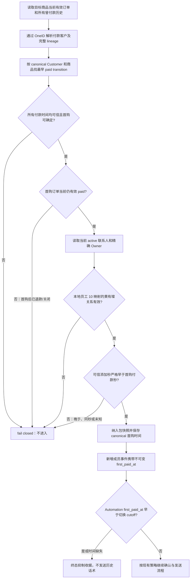

# 人群包 #27：付款时已是黄有璨企微好友

## 业务判断

仅为显式启用此规则的人群包增加条件；包 #27 的商品 `334465678` 使用它。客户对目标商品的全 OneID lineage 首笔可信付款是唯一触发付款。该首购发生时，客户必须已经是指定的黄有璨企微账号的有效外部联系人。付款后才添加联系人，不会因欢迎语、目录同步或再次购买补入包。首购先于本规则切换的合格客户可以留在人群包，但历史入包事件不得重新发送。

## 规则与数据边界

- 规则只在后端显式 opt-in 时生效；包 #27 保留 `owner_scope=all`。不能用 `owner_scope=specified` 代替好友账号筛选，因为旧订单可能没有稳定的 `OwnerReference`，会无意排除这些订单。
- `friend_owner_staff_ids` 必须通过 Access Owner Port 解析；包 #27 配员工 ID `10`，并要求解析到精确企微 userid `HuangYouCan`。不得按显示名称模糊匹配，也不得以其他员工的跟进关系代替。
- 对每个 canonical Customer 和商品，订单 Owner 的只读 history Port 汇总所有曾有 `paid` 状态的订单历史，包括目前已退款或关闭的首购。以最早可信 `paid_at` 确定唯一首购；相同时间按稳定 Order ID 决胜。若任意曾付款记录的付款时间不可信，不推测首购；若最早首购订单当前不是有效 `paid`，后续重购不能冒充首购。
- 当前 active 联系人关系必须归属于精确的 HuangYouCan userid。企微 `createtime` 与回调 `CreateTime` 只有秒精度，因此只有 `followed_at.Unix() < first_paid_at.Unix()` 才证明好友关系先于付款；同秒 fail closed。缺少 trusted 时间、关系已删除、OneID 不可用或映射失败时均不入包。
- `ObservedAt`、本地行 `created_at`、同步时间不代表添加时间。成功的 Provider 目录同步写入 `followed_at`；经过验签且联系人身份已验证的新增回调可实时写 active-since，支持下一轮 3 分钟评估；edit 保留，delete 清空，重新添加写新时间，乱序旧回调不得复活关系。
- Segment 快照保存 `FirstPaidAt`，MemberEnteredV1 事件复制并读回相同时间。刷新重试把成员资格时间纳入 batch digest；同一 run/ordinal 同样客户 ID 但首购时间改变时返回冲突。旧快照/事件的时间为 NULL。
- Migration 0213 为已有 refresh batch 写零 fact digest，随后移除列默认值。旧配置/旧 run 的兼容 `StageRefreshBatch` 重试继续提交零摘要并与迁移值一致；friend-gate 通过新配置版本使用含首购事实的摘要，不复用旧配置 batch。旧事件的首购时间保持 NULL，不伪造回填。
- `FirstPaidAt < defer_before_first_paid_at` 由 Automation 在历史发送边界抑制，严格早于 cutoff 才抑制。时间缺失的旧事件对已启用 cutoff 的策略 fail closed，并生成可见的跳过结果和终态收据。这个 cutoff 不剥离已合格历史客户的人群成员资格。

## 复用、分类与参考

- **OneID：涉及。** 复用 Customer 稳定 canonical resolver 解析所有付款根与企微联系人根；不新建匹配规则或修改身份关系。
- **Persistence：涉及。** 通过 Order Owner 的只读 history Port 读曾付款事件；WeCom Owner 投影可信 `followed_at`；Segment Owner 持久化快照事实、batch 摘要与版本化 member-entered 事件。刷新成员/事件状态由现有 PostgreSQL 事务所有者管理。
- **External Effects：本候选不新增。** 不增加企微写入、队列、Worker、重试或外部效果状态；历史发送抑制复用现有 Automation/Outbound 边界。
- **页面影响：无。** 新资格只通过现有后端配置端口启用，不注册模板表单字段、不增加管理员 UI 能力。受控全量重算仅给已有管理员 refresh API 增加可选 `full_refresh` 请求字段。
- **官方参考：** 企业微信 [externalcontact/get](https://open.work.weixin.qq.com/api/doc/90000/90135/92114) 与 [externalcontact/batch/get_by_user](https://open.work.weixin.qq.com/api/doc/90000/90135/92994) 的 `follow_user[].createtime` 提供按员工维度的添加 Unix 秒。若文档路由调整，按接口名核验；不能用本地观察时间替代。
- **GitHub 参考：** [go-laoji/wecom-sdk](https://github.com/go-laoji/wecom-sdk) 的 external-contact 类型把 `createtime` 映射为整数时间值，仅作为字段映射案例，不复制其实现。
- **仓库复用：** `customer/port.CanonicalCustomerResolver`、`order/port` paid-history Reader、`wecom/port` 联系人 Reader、WeCom 既有验签生命周期回调、`access/port.AudienceOwnerReferenceReader` 和 Segment 快照/成员事件 Port。
- **API 合同：** 管理员 `POST /api/admin/ai-audience/packages/{package_id}/refresh-runs` 接受可选 `full_refresh:true`，映射到现有 complete `daily` refresh kind，且只允许包处于 paused。字段缺省/false保持当前配置默认和幂等键；仍要求管理员会话、CSRF 与稳定 `Idempotency-Key`。响应是 durable refresh accepted，必须回查 run 至 `published`；accepted 不代表刷新完成。旧 `/refresh` 路径仍走同一 handler。

## 验收与影响判断

1. Provider 联系人详情保留 `follow_user[].createtime` 秒值；缺失保持 unknown。同步与回调遵守 active 关系生命周期；只有受信来源可写 `followed_at`。
2. opt-in 人群只接纳首购订单当前有效 paid、HuangYouCan 当前 active 联系人，并且添加秒严格早于首购付款秒的客户。付款后添加、同秒、无好友时间、仅其他员工关系、历史付款时间未知均排除。
3. 对同一客户商品，跨 OneID 合并前后所有曾付款历史取首笔。后续购买不能掩盖首笔先于加好友的情况；首笔已退款/关闭也不能由后续有效订单触发。未经 opt-in 的其他 `paid_order` 包保持旧过滤与身份输出语义。
4. Segment snapshot 和 MemberEnteredV1 事件携带同一个 canonical 首购时刻。首次 staging 后完全相同的重试成功，时间值发生变化的相同 batch 重试返回冲突；旧事件 NULL 被启用 cutoff 的 Automation 终态抑制。
5. 成功预发与真实业务读回应分别验证：OneID 合并 payer 到联系人根、精确员工映射、成员快照和事件时间；Automation 抑制与终态收据。编译或 mock 不视作 Provider/安装/业务验收。

## 生产只读核验（2026-09-30）

针对已审阅的 88 个 OneID 合并候选，按付款根和拟保留联系人根合并目标商品全部曾付款历史，计算全 lineage 最早 paid transition；逐一用 Provider `externalcontact/get` 读取精确 HuangYouCan 关系 `createtime`。匿名结果：88/88 联系人身份可解析、88/88 首购时间可解析、88/88 Provider 详情读取成功；46 个添加秒早于首购秒，42 个晚于，0 个同秒，0 个时间未知。

核验只读：生产数据库设置 `default_transaction_read_only=on` 并使用有界查询；企微仅执行联系人详情读取；未进行生产写入或发送。不保留或输出外部联系人 ID、UnionID 或客户 ID。上述 88 个均为切换前历史候选：按资格，46 个合并后可以保留在包内，42 个因付款后才添加而不入包；46 个的首购时间早于 automation cutoff，故不会由合并补发历史话术。

## 切换要求与限制必要性判断

生产 #90 全员目录同步约需 8 小时，且当前遍历全员；本候选不扩大同步范围或并发。安全切换顺序：保持 Automation policy active；先写入并读回 `defer_before_first_paid_at` cutover 和历史 ID deferral 清单；暂停包 #27；完成一次成功目录 run 并核对 `followed_at` 历史覆盖；配置并读回新 friend-gate、商品和员工 10；通过同一管理员 refresh API 用 `full_refresh:true` 发起受控 complete refresh；等待 refresh run `published`，核对 exits/新成员/成员事件首购时点和没有 cutover 前历史 Outbound；确认 `every_3m` 配置仍在，然后恢复包，后续 3 分钟增量沿用已发布新快照。全量重算必须发生在 cutoff 和历史 deferral 生效之后，以免不合格的旧成员被增量快照继续保留或重算出的历史成员触发旧话术。实时新增好友可由回调及时提供 active-since，不需要等下次全量目录同步。

新增资格限制来自用户明确提出的付款时好友关系规则；时序要求来自 Provider 时间只有秒精度及已确定的首购语义。仅对显式 opt-in 包实施；其他付费人群逻辑保持原样。**不涉及新增限制**之外的通用模板/UI 校验。
