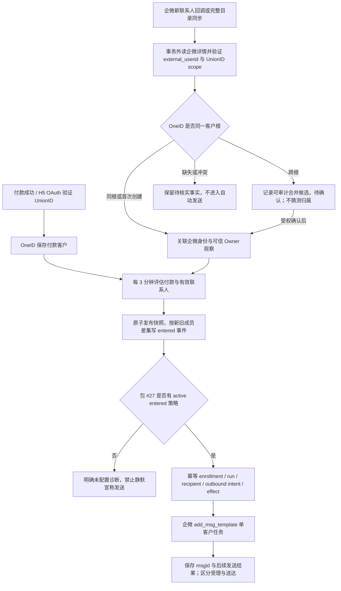

# 商品 334465678：付款身份、人群增量与自动话术闭环

- 状态：本任务已授权实施；生产配置和真实发送须逐项读回。
- 原始诊断基线：V4 国内 `main@195a5bb9d46f341ae8d57fdc65e58af9da007ede`；最终候选重放到累计预发基线 `d0023676d6d366a07fdeb5ec47a34b3c68dc2441`。旧 `AI-CRM` 仅作行为参考，不作代码或运行时来源。
- 当前生产只读事实（2026-09-30）：包 #27 为 `every_3m`、`paid_order(product=334465678, require_active_wecom_contact=true)`，29 名成员、29 条进入事件；固定话术 Agent #14 active；`automation_policies`、enrollment、run、自动发送 intent 均为 0。9 月 29 日付款 122 与包 26 的差额中，33 名已有企微目录活跃 Owner 观察但缺 follow 表行，另 63 名付款 Customer 根未对应到企微档案；此前只读 Provider 比对有 62 名的 scoped UnionID 精确候选，1 名未确认。9 月 23–29 日 daily 目录同步均因可选联系人备注意图返回 `contact description explicit replan required` 而终态失败；9 月 29 日手动同步成功。
- 同日稍后只读复核：包当前快照有 31 名成员，sender set #5 仅含内部 staff #45 (`huangyoucan`)；企微 `/cgi-bin/user/get` 对大小写两种输入均返回 canonical `userid=HuangYouCan`，对应内部 staff #10。31 名中与 staff #10 有效跟进的为 6 名，staff #45 为 0 名；31 名均至少有其他有效跟进。应把发送人集合换为 staff #10，并对其余目标的该账号发送资格单独核验，不能因为客户有其他员工跟进就假定黄有璨可发送。
- 生产运行配置只读复核：付款 OAuth Open Platform scope 已配置，企微身份链路读取的 `AICRM_WECOM_UNIONID_OPEN_PLATFORM_ID` 尚未配置。预发和生产在启用身份关联前，须核实两路 Provider 身份属于同一个开放平台，并设置企微 scope；只看到配置字符串相同不足以证明 Provider 关联成功。此项由发布指挥台在准确候选晋级时处理。

## 业务判断

### 参考与复用

- 旧仓的 [IdentityBridge](https://github.com/qianlan33333-png/AI-CRM/blob/dd8d60dd8ddb983aca2ec88cc9e65a9f7563f79f/aicrm_next/channels/channel_entry/identity_bridge_service.py#L183-L239) 在企微详情缺 UnionID 时保持 pending；[人群刷新](https://github.com/qianlan33333-png/AI-CRM/blob/dd8d60dd8ddb983aca2ec88cc9e65a9f7563f79f/aicrm_next/extensions/ai/ai_audience_ops/refresh_service.py#L109-L240) 只为新成员生成 entered；[绑定](https://github.com/qianlan33333-png/AI-CRM/blob/dd8d60dd8ddb983aca2ec88cc9e65a9f7563f79f/aicrm_next/extensions/ai/ai_audience_ops/automation_binding/repository.py#L290-L347) 要求 active 自动化。参考其行为，不复制旧代码。
- V4 复用 Identity Port、WeCom 目录/Owner 观察、Segment paid_order/快照/River、Automation policy/enrollment/run、Outbound/EER、企微单客户 `add_msg_template` 及结果查询。客户群聊 `chat_type=group` 是 Group Ops 独立链路；本包收件人是购买者外部联系人，发送使用 `chat_type=single`。

## 交付范围与验收

1. **身份与目录**：付款 OAuth 和企微详情都只在可信 Adapter 铸造带开放平台 scope 的 verified UnionID。新增联系人回调在开启数据库事务前读详情；目录同步也把详情中的 UnionID 送到窄 Identity Port。同根时把 external_userid 链到付款 Customer；跨根只产 merge candidate，缺值、异 scope、重复或冲突不猜测。现存 62 个候选需重新用受信 Provider 详情核对并按 OneID 受权确认，1 个未命中留待核实。目录同步中的联系人备注计划不可自动重规划时，记录未提交诊断并继续身份/Owner 投影，不能让这一独立外部效果阻断全目录读取。不得在 Segment 建第二套 UnionID join。
2. **联系人资格**：`require_active_wecom_contact=true` 应识别成功完成的企微目录 Owner 观察，以及可信企微新增回调立即建立的 active follow 事实；刚添加且尚无目录 profile 的新联系人不能等到次日同步才入包。较新的删除回调、已完成目录的失效事实、未完成/失败目录 run 和 unknown/ambiguous Owner 不应误纳入。指定发送人时仍需精确员工映射。付款用户即使尚无企微联系人仍有订单事实，但不得伪称为可发送的包成员。
3. **增量**：每三分钟可重新评估源事实并发布快照，但只对真正新增的 canonical Customer 产生一次 entered 事件；保留成员的进入时间不随刷新改写。重放、重启、相同付款或相同目录观察不重复入组或发送。
4. **自动化**：按既有独立策略合同为包 #27 建并激活 `audience.member_entered.v1 → outbound_message(agent_id=14)`，发送人集合必须使用企微 Provider 返回的大小写精确 `userid` 所对应的内部员工。该活动不受 22:00–08:00 免打扰限制；策略 quiet hours 允许明确“无”，不影响已有时段配置。缺 active 策略时必须留下可查询的持久化诊断收据，不能把派发 job 成功说成自动化完成；诊断提交后、River ACK 前发生的晚到重试仍视作已处理，不能因策略后来激活而补发。历史 29 条及随后补出的身份关联事件不自动全量补发，只对明确选择的事件做受控幂等回放。
5. **真实发送**：Automation 在一项 UoW 中持久化 enrollment、run、recipient、冻结话术、Outbound intent/EER；Provider 写只经 Outbound。企微 `msgid` 是任务受理，按原任务查询 `get_groupmsg_send_result` 后才能说目标送达；`outcome_unknown` 不换键盲试。

验收顺序：真实 PostgreSQL + River + 虚拟企微服务验证付款/联系人同根、33 个目录观察资格、跨根候选与拒错、一次新增一次 entered、策略激活与固定话术生成、`add_msg_template` 请求及 msgid/目标结果；预发安装同构旅程；生产核对当前数据与迁移、包成员差额、active policy、未来真实新增付款的 enrollment/run/intent/effect/Provider 回执。生产真实支付与真实企微发送结果独立于技术安装记录。

## 边界与影响

| 维度 | 决定 |
| --- | --- |
| OneID | 涉及 verified scoped UnionID、external_userid 链接与可审计跨根 candidate；只通过 Identity Port，禁止隐式合并。 |
| 持久化 | Identity/WeCom/Segment/Automation 各 Owner 本地事务；Segment 和 Automation 复用现有 River；同步详情属 Provider read，事务外调用。 |
| 外部效果 | 自动消息复用 Outbound/EER 的 `outbound_message`、稳定幂等键和原 effect 对账；不新增 Provider writer、队列或重试状态机。 |
| 对外合同 | 新联系人与目录事实影响包成员；缺策略诊断存入现有运行收据，可由运维只读查询；无免打扰作为明确策略值。原人工发送与 Group Ops 不变。 |
| 关联模块 | Identity、WeCom、Payment 付款身份、Segment、Automation、Outbound、EER、Access 与组合根；按准确 diff/依赖图选测。 |
| 页面影响 | 后端修复；既有人群详情进入时间恢复真实首入语义。若新增可见控件或页面行为，编码前使用 Product Design。 |
| 验证证据 | 精准单测、PG/River 联合旅程、企微协议测试、预发与生产读回分开；不得把 queue/HTTP 200 当发送成功。 |

新增限制只复用已有 OneID 的 verified scope、候选审核和 Outbound 效果门；不新增任意数量/时段门槛。若历史合并确认或发送会造成不可逆影响，在执行前展示逐项证据与待执行范围；回退使用现有 policy pause 和 Provider gate，已被企微接受的任务只能按原键对账，不能撤回或重发。本次不新增数据库迁移，不手工改跨域表。
