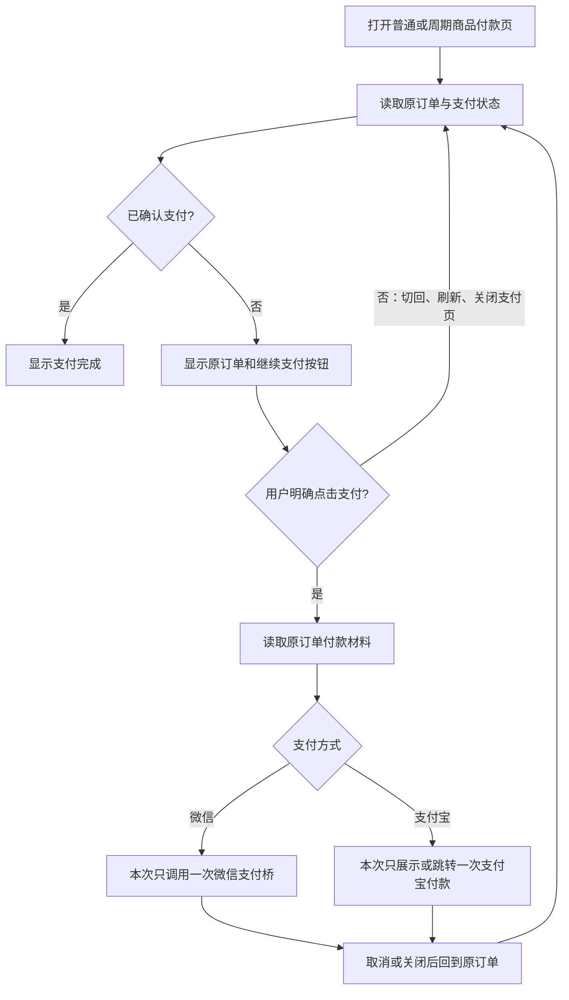

# 商品支付只由明确点击拉起

## 业务判断

现状根因：共享付款模板的 `visibilitychange`/`pageshow` 会重启轮询；轮询看到未支付订单仍有 handoff，就可直接调用微信支付桥。支付宝在页面恢复时轮询并调用 `showAlipayGuide`，刷新后内存中的“已展示”标志丢失，可再次展示引导或跳转。普通商品 `/pay/{code}` 与周期商品 `/s/{code}/pay` 使用同一模板。

## 参考与复用

- [W3C Payment Request](https://www.w3.org/TR/payment-request/) 把支付界面的显示与用户激活联系起来，避免无交互弹出支付 UI；此处只借鉴交互原则，不引入该 API。
- [Stripe.js PaymentRequest 类型合同](https://github.com/stripe/stripe-js/blob/master/types/stripe-js/payment-request.d.ts) 要求 `show()` 源于用户交互，并区分支付界面关闭事件；此处只借鉴显式点击和取消语义。
- 复用当前 V4 `internal/product/http/public.go` 的订单恢复、状态轮询、原订单 handoff 和 `sessionStorage` 幂等键。不新增订单、Provider 调用、视觉组件或持久化字段。

## 行为与验收

1. 首次点击“立即支付”后，微信只调用一次 `getBrandWCPayRequest`；支付宝只显示一次引导或跳转一次。
2. 取消、关闭、切回、`pageshow`、刷新、轮询继续读取状态，但不会自行再次打开支付能力。未支付时按钮允许主动继续原订单。
3. 用户再次点击时，可再次调用同一订单的付款材料；不得创建第二笔订单或换幂等键。
4. 已支付、过期、弃单、Provider 结果不明沿用现有保护与提示。状态查询不得被误判为付款成功。
5. 普通和周期商品、微信和支付宝均运行模拟旅程；生产真实支付另行验收。

## 影响与边界

| 项 | 结论 |
| --- | --- |
| 对外合同 | HTTP、订单、回调和 Provider 合同不变；页面自动拉起行为改为仅明确点击。 |
| 业务机制 | 继续保留原订单、幂等键与状态查询；不改金额、归属、支付状态。 |
| 关联模块 | Product 公共付款模板调用 Payment checkout 只读状态和已有 handoff；普通与周期商品共用。 |
| 页面影响 | H5 公共付款页的自动恢复、关闭后按钮与支付宝引导；沿用既有样式。 |
| 验证证据 | 取消/切回/刷新/再次点击的 JS 旅程，以及 Product/Payment 相关测试和预发虚拟支付旅程。 |

OneID：只读取既有已授权付款会话，不新增身份解析或归属。Persistence：沿用现有订单事务和浏览器 checkpoint，无新存储。External Effects：Provider 付款能力仍由既有 Payment handoff 承载；本次只调整前端调用时机，不新增写入、重试队列或效果状态机。不涉及新增限制。

Product Design 审查：沿用当前付款页、状态区与按钮；关闭支付界面后应回到原订单，由按钮传达下一步。没有视觉重设计或公共组件缺口。真实 Provider 界面不能在虚拟旅程中截图验收，预发只验证本页交互和调用次数。

回退：回退此候选包；不涉及数据库迁移。预发通过后按 CRM v4 发布工作台的唯一指挥台继续发布，真实支付单独读回。
