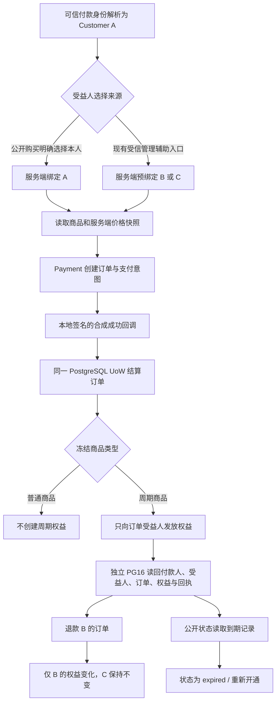

# PROD-04 产品与受益人隔离矩阵（本地 QA）

状态：独立本地验证设计；不扩展产品合同，不作为 PROD-04 全矩阵通过。

## 目标与范围

在隔离 PostgreSQL 16 中，以 Payment Session、Payment checkout 和 Order 结算应用路径核对：普通商品不会发放周期权益；服务端预绑定的 `admin_assisted` 受益人收到周期权益；两个独立订单能分别绑定不同受益人；一个订单退款只影响该订单对应的受益人；已到期权益在公开状态读口呈现为过期。

本轮不实现或推断公开赠送、单个订单多受益人、定时到期任务或任何 Provider 写入。这些能力不在现有合同中；应作为范围问题/功能缺口另行确认，不能自动判为不适用。测试中的“赠送”仅指合同已有的、由可信服务端签发并预绑定受益人的 `admin_assisted` Payment Session。

## 业务流程

## 边界分类与影响判断

- OneID：只复用可信 Payment Session 中已经解析的 canonical Customer ID；不新增身份匹配、建客或合并规则。
- 持久化：涉及；Payment、Order 与 Order 权益在既有 PostgreSQL Unit of Work 内协作，断言从数据库独立读回。
- Durable job：不创建到期任务。测试不运行 River worker；预支付意图即使入队也不执行。
- Provider：仅使用本地合成、签名回调驱动应用结算；不调用 Provider、不产生真实资金或外部发送。
- 前端：不修改前端或页面；通过现有公开状态 JSON 读口验证过期投影。
- 影响：无 API/迁移/支付协议变化；覆盖 Payment、Order、Product checkout 快照和 Entitlement 协调边界。

## 参考与复用

本地规则以 `03-product-payment.md` 第 3、7 节和 `04-entitlement-coupon.md` 第 1、2、7 节为准：公开购买只能明确选择本人；`admin_assisted` 受益人由可信服务端预绑定；不新增公开赠送；周期权益只能按已支付订单快照发放。

参考 Shopify 官方礼品卡收件人流程：[Add a gift card recipient form](https://shopify.dev/docs/storefronts/themes/product-merchandising/gift-cards)。该案例明确把收件人资料作为礼品卡产品的单独订单属性/通知流程；它是产品形态对照，不是本项目授权新增礼品卡或公开赠送的依据。本轮复用 V4 已有 Payment Session、Payment、Order、Entitlement 与公共状态读取 Port。

## 验收矩阵

| 维度 | 合同内的本地断言 |
|---|---|
| 商品类型 | `standard` 已支付订单不创建周期权益；`service_period` 按冻结的产品 ID、周期天数结算 |
| 受益人 | 付款人 A 与受益人 B 分离时，权益只属于 B，A 仍无该商品权益 |
| 多受益人 | 同一付款人发起两个独立预绑定会话和订单，分别给 B、C；这不代表单订单多受益人 |
| 跨客户退款 | 退款 B 的来源订单后 B 失效；C 的独立权益、来源订单与受益人仍保持原状 |
| 到期投影 | 隔离库中的到期权益从现有公开状态读取路径显示 `expired` 与“重新开通” |
| 独立预言机 | 对比 PostgreSQL 内的 payment/order/customer/checkout snapshot/entitlement/refund/callback facts，而不以 HTTP 成功响应作通过依据 |

## 本轮限制

该矩阵是 PROD-04 的一个局部、合同内补充。公开赠送与单订单多受益人仍需范围确认；历史完整性、多商品、并发退款、浏览器 journey、Linux 运行及发布工作台收据均不由本测试覆盖。E3 24 小时和 100k 混合负载维持暂停。
