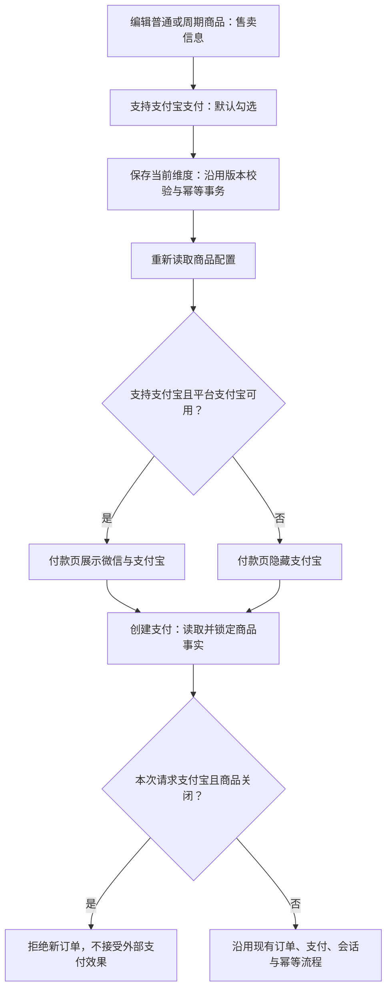

# 商品支付宝支付开关

用户已授权：普通商品与周期商品的编辑页「售卖信息」增加「支持支付宝支付」，默认开启；关闭后付款页仅展示微信支付。

## 参考与复用

参考 WooCommerce [条件支付方式](https://woocommerce.com/document/conditional-payment-methods-for-woocommerce/) 与 [支付方式接入](https://developer.woocommerce.com/docs/block-development/extensible-blocks/cart-and-checkout-blocks/checkout-payment-methods/payment-method-integration)：按商品条件计算可用方式，同时在服务端校验。

复用 Product 持有的 products.legacy_admin_projection，新增布尔 alipay_enabled，缺失视为 true。两类商品沿用原 CAS、幂等收据、事件和事务；无需数据库迁移。复用 Product CheckoutProduct Port 传递禁用事实，以及两类商品共用的付款模板和 Payment 创建流程。不新增支付 Provider、队列或重试机制。

Product Design：使用 index/user-context/get-context/audit 审查现有已登录商品售卖信息；参考截图 docs/design/product-alipay-toggle/01-sale-reference.png。既有白色表单、两列布局、12px 标签、36px 控件和默认复选框作为视觉基准，新增设置沿用现有控件样式。该次审查仅证明现有普通商品表单；后续验证覆盖两类商品保存与支付呈现。

## 行为与边界

- 开关文字「支持支付宝支付」；开启提示「支持支付宝和微信支付」，关闭提示「仅支持微信支付」。新旧商品缺失配置默认开启。
- 只有保存当前维度成功后生效；切换到其他维度保存保留已存支付设置。加载失败不得用默认值覆盖已存配置；版本冲突沿用原错误。每次点击冻结开关选择与幂等键，保存中继续修改的草稿用于下一次保存。
- 付款页根据商品设置与平台 Provider 能力交集显示。微信环境约束与支付授权保持原流程。
- Payment 在锁定商品且创建订单之前检查，关闭时支付宝请求返回明确拒绝；微信仍允许。已有支付的幂等重放、查状态、回调、退款保持原交易事实，不能因设置改变另建订单或清空结果不明的恢复记录。
- OneID：不改变客户身份，复用已有支付会话。Persistence：商品本地事务。External Effects：只改变新支付准入，复用原 Payment 效果合同。
- 最小必要限制：新支付宝订单仅在商品支持时允许，依据为用户明确要求；不新增权限或数量限制。

## 五项影响与验证

对外合同：商品投影新增可选布尔字段，付款页支付宝选项条件变化，新支付宝创建可拒绝。
业务机制：同一商品行和原事务写入；身份、幂等、原订单恢复保持。
关联模块：Product app/port/http 与 Payment app/http；管理端 productAdapter 和公开付款模板。
页面影响：普通/周期商品售卖信息、两类付款页；不改变其他维度、商品详情与历史订单。
验证：默认兼容、关闭/开启保存与回读、非售卖维度保留、两类付款页不渲染支付宝、微信创建仍可用、支付宝拒绝无订单/支付效果、已有支付重放；fast、compile、受影响包完整测试及相关 UI 合同。Linux 真实 Host 虚拟支付旅程由发布指挥台补齐。

回滚：回退应用版本前先将受影响商品恢复支持支付宝；旧应用不能执行新增限制。无需数据回滚或迁移。真实 Provider 付款与生产管理员回读分别记录。
