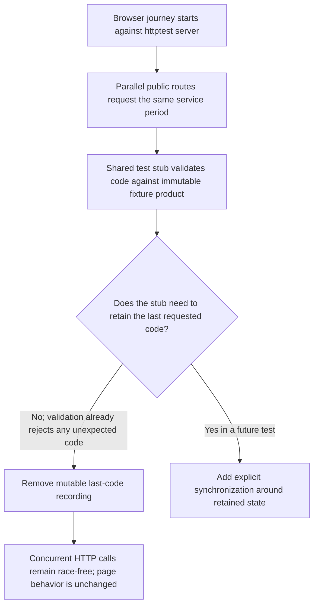

# Service Period public HTTP test stub race

## Decision flow

## Problem and root cause

The full backend race lane at base `73de4fb8ea9626077a39e3fafbc6724eae824201` failed only in `TestServicePeriodPublicBrowserJourney`. Its `httptest.Server` handles browser-journey requests concurrently. Each call to `servicePeriodPublicStub.ReadPublicServicePeriodByCode` writes the shared `code` field, although the stub already checks the argument against the immutable expected `product.Code`. The field is read by a separate single-request test assertion. The race detector therefore reports concurrent writes to test-only state; no production handler, product state, persistence, or Provider call is implicated.

## Scope and classification

- OneID: not involved; this test serves a fixed public product code and customer identity is not resolved.
- Persistence: not involved; the stub is in-memory and this test does not use a database.
- External Effects: not involved; no Provider or payment action is invoked.
- Product code and rendered behavior: unchanged. Keep the fixture's exact-code rejection as the behavioral assertion, remove redundant mutable call recording, and add a concurrent-handler regression using the same public route.
- Restrictions: 不涉及新增限制。

## Five impact judgments

1. **External contract:** none; only Go test code changes.
2. **Business mechanism:** none; expected-code validation and HTTP behavior remain the same.
3. **Related modules:** limited to `internal/product/http` test fixtures and tests.
4. **Page impact:** no UI implementation or page contract change. The existing browser journey remains as an integration-level behavior check.
5. **Verification evidence:** run the focused regression and failing browser journey with `-race`, the full affected package race test, `fast`, Go `compile`, and `affected` against the exact candidate base.

## Reuse and references

Reuse the existing `servicePeriodPublicStub`, public service-period handler, and `httptest` patterns; do not introduce another fixture abstraction or synchronization framework. Go's race-detector guidance recommends `go test -race` and synchronizing shared state with a mutex, channel, or atomic operation. A GitHub test-server example also protects shared handler-test state with a mutex: [Zalando Skipper GHSA-659f-rgp5-w4wf](https://github.com/zalando/skipper/security/advisories/GHSA-659f-rgp5-w4wf). Here, removing unnecessary mutable tracking is smaller because the immutable fixture already validates every supplied code.

- [Go race detector](https://go.dev/doc/articles/race_detector)
- [Go `sync.Mutex`](https://pkg.go.dev/sync#Mutex)

## Acceptance

- The new concurrent public-handler test verifies all requests return HTTP 200 and runs clean under `-race`.
- `TestServicePeriodPublicBrowserJourney` continues to pass under `-race`.
- `internal/product/http` passes with `-race`.
- Required `fast`, `compile`, and exact-base `affected` evidence is recorded for the committed candidate.
- No production code, external systems, or shared release state is changed.
