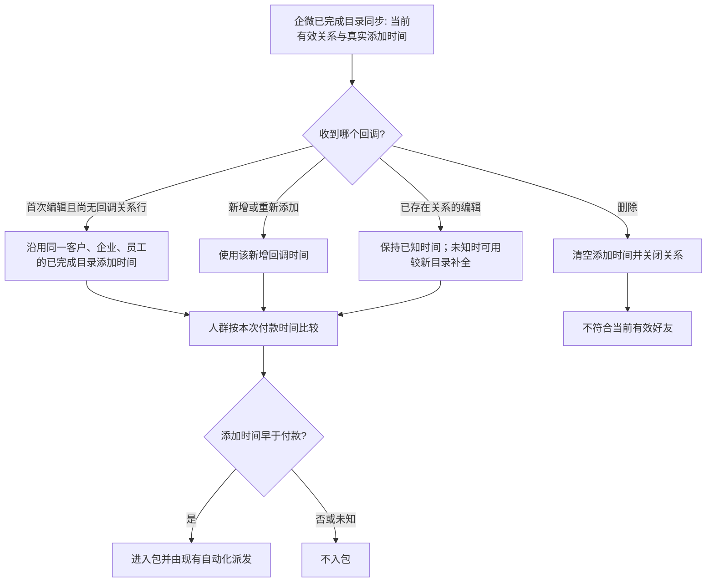

# 企微编辑回调保留加好友时间：生产缺陷修复

## 证据与业务判断

生产商品 `334465678` 的两笔付款，客户已由 OneID 正确关联 HuangYouCan，目录在 19:54 读到 6 月的企微 `follow_user.createtime`。付款后几秒的 `edit_external_contact` 回调第一次写入 `wecom_follow_relationships`，`followed_at` 为 NULL；人群读取以较新回调覆盖目录时间，两个客户因此缺席 #27。20:54 企微目录再次完成后，20:57 包刷新使两人入包，自动化和企微接口均达到 `provider_accepted`。第三笔的企微真实添加时间晚于付款，正确排除。

## 复用与边界

- 复用 V4 `internal/wecom` 的回调关系 Store、已完成目录记录和现有 audience reader。行业事件格式参考 [企微客户联系事件格式](https://s.apifox.cn/apidoc/docs-site/406014/doc-417790)；生产签名回调与企微 `createtime` 的实际读回是此次行为依据。
- OneID：只读已解析的 `customer_id`；不创建或合并身份。
- Persistence：在 WeCom 现有 PostgreSQL Unit of Work 内读取本域目录事实并写入本域关系行。不增加迁移、队列或异步任务。
- External Effects：无新企微写入。继续使用既有 Segment → Automation → Outbound 发送链。
- 对外合同与页面：无变化。受影响领域为 WeCom 回调关系存储及 Segment 好友时间读取。
- 限制：复用“已完成目录运行、当前有效关系、真实 `followed_at`、目录采集早于回调”的边界，不新增业务限制。

## 验收

1. 目录中已有真实添加时间、首次回调为编辑时，关系行保留该时间；人群读取看到这一时间。
2. 无可信目录时间时保持未知；较新目录可在后续编辑时补全。已删除关系后的编辑不恢复旧时间；重新添加使用新回调时间。
3. V4 准确 HEAD 上运行 fast、compile 和 WeCom 受影响测试，并由唯一发布指挥台完成预发与同包生产晋级。生产读回核对后续真实编辑回调不再遮蔽付款前好友时间。
