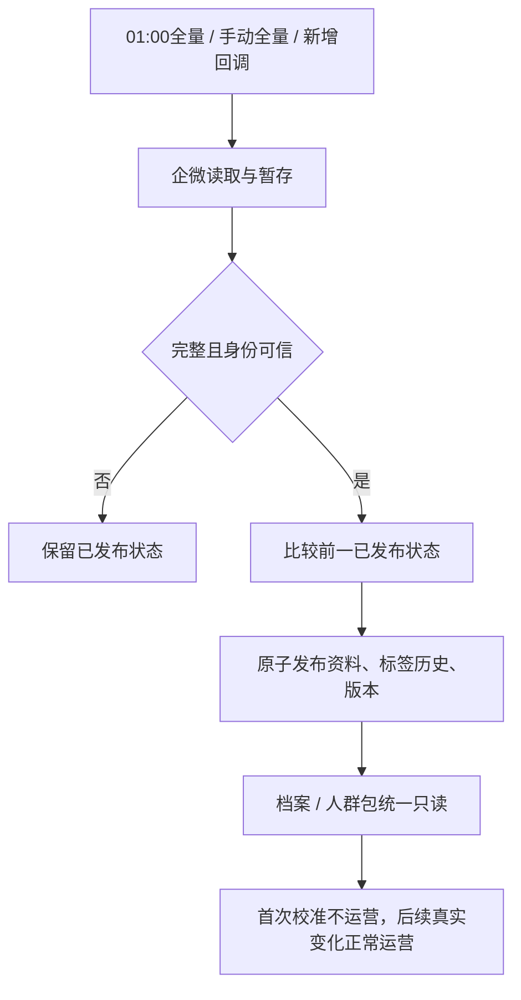

# 企微客户资料统一同步与标签变更历史

用户已确认完整方案，本文是同一能力的父 PRD。OneID：读取/解析既有 canonical customer，复用 Identity Port；Persistence：PostgreSQL UoW、River 持久任务、Provider 只读；External Effects：既有企微写保留 outbound，目录刷新不产生写意图。无新增业务限制，复用权限、Provider 合同和幂等边界。

## 合同
- 仅统一同步维护企微 profile、follow-user、当前标签及增减历史。每天北京时间01:00，手动刷新复用正在进行的任务；只有新增回调即时同步。
- 标签初始基线日期2026-09-30，实际采集时间独立；新增、移除、重新添加不可覆盖，按成功发布差异计算。员工维度保留，客户汇总按并集，不把基线算为后续新增。未知字段/权限/失败不推断删除。
- 全量先暂存后原子发布；更新较新的增量优先。网络读取不持有事务。
- 删除重复关系/本地归属及其业务读写。已知企微操作由Provider校验关系，身份、权限、幂等和外部效果不变。
- 人群创建、预览、定时、发布、运营全链路切换到同一来源版本；首次 source_rebase 不发进入/退出/资格变化事件。付款资格必须用可信好友时间。
- 客户档案新增企微信息、员工、标签及可查询历史；渠道显示Provider来源和CRM历史。Product Design沿用当前已挂载后台样式，不引入新框架。

## 复用与参考
- WeCom owns现有资料观察/同步；Customer owns档案投影；Segment owns成员快照；River owns持久执行；Identity/outbound边界保持。
- https://github.com/openscrm/api-server/blob/master/app/models/customer_staff_relation.go ：复用备注、描述、加好友时间、添加方式、state和员工标签字段组织，不复制它的回调关系写入。
- https://help.youzan.com/displaylist/detail_4_4-1-52839 ：客户列表→详情入口及资料分区。

## 五项影响与验收
对外合同：新增历史/统计读取、资料字段和同步状态；业务机制：原子发布、差异账本、来源校准；关联模块：wecom/customer/channel/outbound/segment/automation/openplatform及composition；页面：实际管理端档案、同步和转接入口；证据：PG16迁移/并发/差异/人群专项与Host旅程。

覆盖基线幂等、无变化、增删重加、改名、多员工并集、失败/缺字段、全量增量竞态、首次校准零运营、付款时间边界。生产先备份和旧表导出校验，初始全量+校准成功、在途旧任务收口后清理。候选推国内并发送唯一发布指挥台，预发后由用户确认生产；技术/Provider/实际业务证据分别报告。历史全量约3m36s，发布后的耗时重新测量。

## 数据生命周期

`wecom_directory_publications` 是当前发布版本投影；两张 staging 表只保存未发布资料，成功发布同一事务删除，失败轮次保留供恢复；`wecom_customer_tag_history` 永久保存已发布的变更事实，不允许通用保留期删除。旧跟进表和本地负责人表不再被运行时代码读取或写入，迁移序列本身保留旧DDL以便历史数据库升级。

## 切换操作合同

1. 发布0216/0217与所有消费方后，先核对旧同步任务、旧回调worker已停止；普通资料全量是Provider读取，独立显式描述维护仍走outbound，不能误用其任务做初始化。
2. 手动触发一次完整全量，核对publication.complete、baseline_initialized、full_observed_at和冲突数。已知标签登记9/30，实际采集时间另存；后续成功轮次按最后成功状态比较。新增回调不刷新完整全量采集时间。
3. 保存全部九种模板及#27的原成员/付款资格快照，资料发布通知沿现有持久队列启动来源校准；校准保留既有执行/幂等收据，核对enter/exit/eligibility运营触发增量全部为零。比较可信好友时间与付款时间，解释所有成员差异。资料不完整或过期时不发布空成员。
4. 删除前由发布工作台生成绑定准确数据库与时间的完整custom-format迁移备份，并验证恢复可读性。离线命令 `go run ./cmd/migrate-wecom-directory-retire --output-dir <绝对私有目录> --database-backup <绝对备份路径>` 默认只导出、回滚。每次使用新目录；核对两张旧表NDJSON行数、SHA256、0600权限和export-receipt。待初始化、已发布人群校准和在途任务条件满足，使用另一新目录加 `--execute`，保存retirement-receipt；不使用CASCADE。
5. 预发合成旅程、人工生产确认及生产实际档案/人群/历史读回由唯一发布工作台完成。真实全量Provider耗时在新版本重新测量，不能把旧3m36s或本地合成数据库耗时当成新容量验收。

## 局部验证证据

本机PG16专项覆盖原子发布、失败回滚、旧全量/新回调时钟竞争、标签基线幂等/增删重加/改名/多员工并集/缺字段、首次人群校准及后续变化。真实登录Chromium Host验证已知目标标签命令执行、outcome_unknown保留与资料/基线历史不被命令回写；页面读取与日期筛选通过。旧表退休工具在独立合成schema验证拒绝条件、dry-run不删及导出校验后删表。Product Design比较见docs/design/wecom-profile-history-qa.md。完整Linux环境、真实#27差异和生产Provider耗时仍属发布切换证据，非本地完成声明。

## Provider投影边界

批量接口的 `follow_info.tag_id` 仅作为枚举结果，随后用最多4个并发只读客户详情补齐员工、标签名称及来源。详情失败整页不暂存、不产生移除；新耗时必须现场重测。详情的企业/规则组标签按稳定ID记历史；未返回稳定ID的个人标签保留展示，并明确增减日期未知，不按名称制造身份或把改名误记增减。
