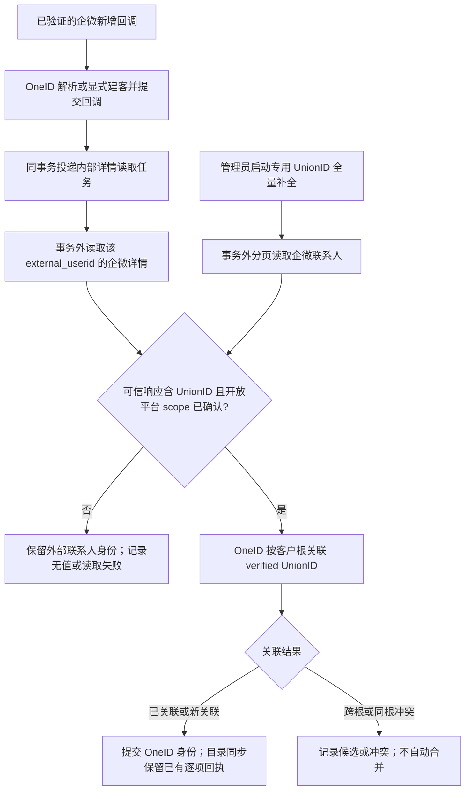

# 企微外部联系人 UnionID 补全

状态：实现中。范围：V4 已有企微客户的全量刷新，以及新增客户回调后的自动补全；不涉及页面。

## 业务判断

验收点：新增回调处理完成后，独立任务读取详情；供应商确实返回 UnionID 时，在正确开放平台 scope 下可由 OneID 查询到。同一客户重复回调和重复全量同步不产生重复身份。供应商未返回时保留既有身份，跨根/同根冲突留在 OneID 治理记录，不猜测或覆盖身份。生产全量刷新须在完整运行结束后比较目录发现数、已存外部联系人数、UnionID 覆盖数、冲突记录和失败运行；仅启动任务不算完成。当前运行回执不单独统计供应商未返回 UnionID 的逐项数量，覆盖缺口通过只读身份聚合确认。

## 现状与参考

- 2026-09-30 生产只读基线：23,562 条 active 企微外部联系人身份，其中 1,050 条同根有 active verified UnionID，22,512 条没有。现有 1,050 条来自 HXC。9 月 29 日的完整手动目录同步处理 23,540 位客户。19 条生产详情只读抽样中，13 条返回 UnionID；10 条已有 HXC 值全部一致。100 条批量目录只读抽样中，93 条返回 UnionID。抽样不代表全量成功率。
- [旧 AI-CRM 实现](https://github.com/qianlan33333-png/AI-CRM/blob/main/aicrm_next/automation/background_jobs/external_contact_sync.py) 按员工列举联系人、逐个读取详情，把非空 UnionID 写入旧映射表。只借鉴“可信详情读取、全量遍历、空值不覆盖”判断；V4 不使用旧表、旧服务或旧数据库。
- [go-workwx](https://github.com/xen0n/go-workwx/blob/v2/external_contact.go) 与 [wecom-app-sdk](https://github.com/go-laoji/wecom-app-sdk/blob/main/external_contact.go) 提供企微客户详情读取的 SDK 参考。V4 复用自己的已验证 WeCom 读取 Adapter，不引入第二套客户端。

## 复用与边界

- OneID：关联外部身份。`customers.id` 仍是客户根；外部联系人 ID 与 UnionID 均为 scoped Identity fact。通过 Identity Port 的 verified link，不直接写 `customer_identities`，不自动合并。
- Persistence：企微 Provider 读取在数据库事务外；回调后的内部持久任务复用 River；Identity 关联或冲突由 Identity 自己在一个 PostgreSQL UoW 提交。专用 `unionid_refresh` 复用已有可恢复的目录同步和逐项回执，同时明确跳过 Outbound 联系人描述写入意图；它仍会更新本地目录投影。回调任务保留 River 状态。本次专用补全不产生企微 Provider 写入或 External Effects。
- 企微来源：新增回调只提供 external_userid；回调事务不等待供应商网络请求。目录同步已取得批量详情，复用同页响应；回调后的专用任务调用单人详情。相同结果共用关联规则。
- Scope：只有已验证企微“客户联系”绑定的微信开放平台 ID 可签发 verified UnionID。部署显式配置该 ID；配置缺失或不能确认时不落 UnionID。不能从 UnionID 字符串猜 scope。当前生产抽样与 HXC scope 一致，仅为此部署的佐证。
- 供应商空 UnionID 不视为系统错误，也不抹掉既有值。跨根返回 merge candidate，同根不同值返回冲突，均需人工治理；不按手机号或更新时间猜根。
- 不新增页面、公开 API、外部效果或新的队列框架。新增仅供管理员调用且有 CSRF/幂等保护的 `POST /api/admin/wecom/unionid-refresh-runs`。显式 scope 是现有 OneID 正确性要求。

## 影响与验证

| 判断 | 范围 |
| --- | --- |
| 对外合同 | 企微回调 ACK 与原管理端目录同步 API 保持原合同；新增专用管理端补全入口。新增后的 UnionID 可在已有授权身份读取中出现。 |
| 业务机制 | WeCom Provider read、Identity verified link、River 内部任务和生产身份持久化。 |
| 关联模块 | 回调处理、目录同步、Identity Port/Store、Composition Root、作业注册；无页面变动。 |
| 验证证据 | 单元合同涵盖非空、空值、重复、跨根/同根冲突、供应商错误；PG 集成检查同事务与持久任务；预发虚拟 Provider 旅程；生产单独核对真实 Provider 和数据覆盖。 |

预部署：以国内源码 `main` 为基线提交独立候选，执行 `fast`、Go 编译、受影响测试和预备机安装/合成旅程；不能把预发虚拟 Provider 当作生产 UnionID 已补全。生产补全属于独立的真实供应商与数据验收，只有完整执行并读回聚合数量后才能报告完成。回滚代码不删除已验证 Identity facts；冲突由 OneID 留存供人工处理。
