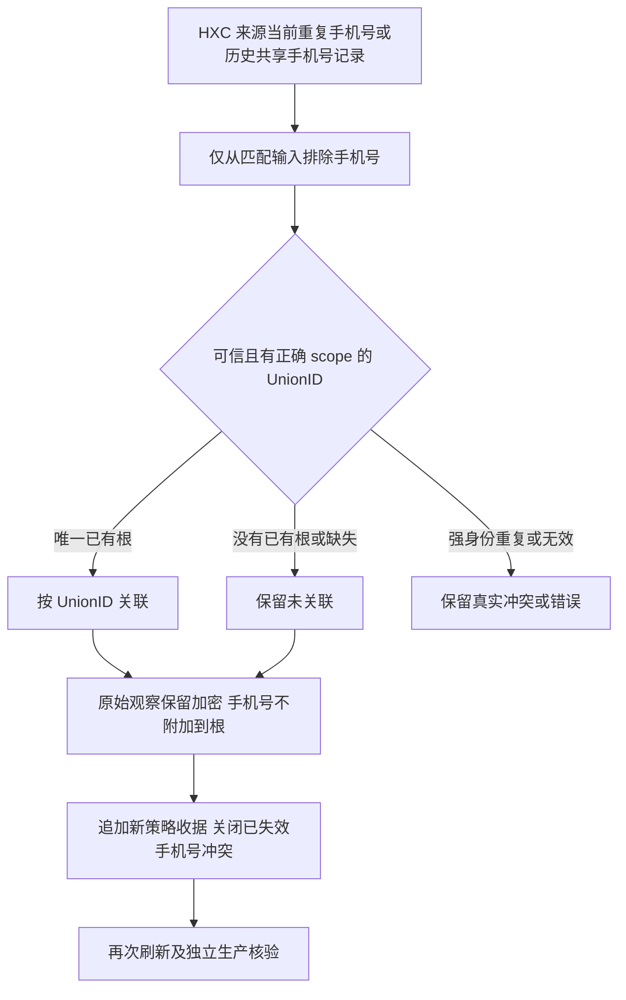
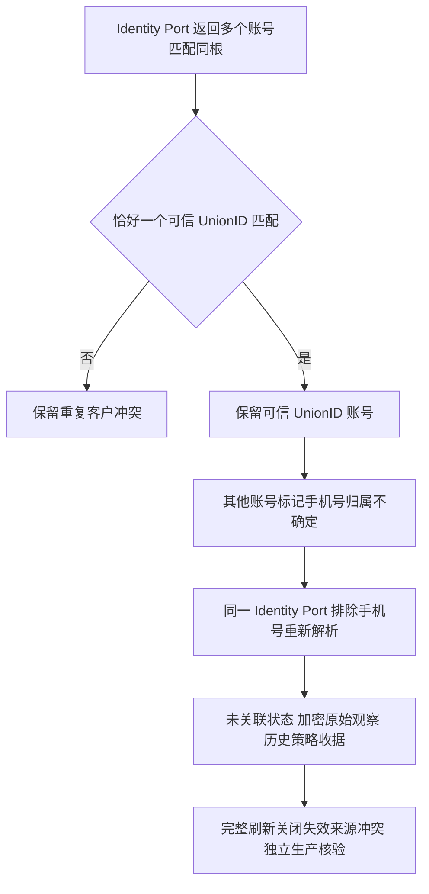

# HXC 共享手机号来源冲突纠正

复用已授权的企微资料统一同步和独立账号纠正 PRD。本次生产核查剩余 33 条来源冲突均为 duplicate_hxc_phone：13 条可信 UnionID 对应唯一 CRM 根，16 条可信 UnionID 尚无 CRM 根，4 条缺少可信 UnionID。共享手机号不能证明账号相同；不合并、不按手机号关联、不隐式建客。

沿用父 PRD 的 [OpenSCRM 员工客户模型](https://github.com/openscrm/api-server/blob/master/app/models/customer_staff_relation.go)参考与生产真实身份核验；复用 Identity 的 scoped UnionID Inspector、来源观察、不可变收据及平台 UoW。OneID：解析已有主根；Persistence：来源当前状态、加密观察和追加收据同事务；External Effects：无 Provider 写入、发送或新队列。

当前重复标记或该精确来源主体的历史 duplicate_hxc_phone 记录触发 UnionID-only 策略。新策略收据作为持续共享手机号处理依据；后续批次重复标记消失也不恢复手机号关联。手机号观察仍按原始输入保存；其他无效/强身份重复标记不清除。仅这一组主体的 rule_version 添加策略后缀，旧收据不可变；每次重新检查 UnionID，使未关联记录在可信根出现后可以正常关联，重复相同结果复用收据。既有 #85 精确已审核纠正继续优先，其他主体不冒用其证据。

五项影响：HTTP 合同和现有原因代码不变；仅共享手机号来源的 Identity 解析及来源持久结果改变；HXC 看板和引用其当前客户事实的消费者受影响，订单/企微资料/人群运营机制不变；无页面代码或交互修改；验证真实 PostgreSQL 的历史冲突重放、当前新增重复、手机号观察保留、无手机号绑定/合并/建客、scope/assurance、未来根出现、重复标记消失及其他强冲突，运行 Identity/HXC 相关领域全集与连接合同。

必要约束复用已有可信身份和 scope 边界。共享手机号排除仅作用于有当前或历史重复事实的精确来源主体，避免错归属；不增加用户审批、阈值或第二套身份中心。无 DDL 迁移。发布由唯一 V4 工作台执行；生产正常 HXC 刷新后核对 33 条结果和 OneID 冲突队列，不以部署代替实际来源读回。回滚保留所有历史，不重新启用共享手机号关联；修复结果需向前补偿。

## 已审核账号的重放补充（基于 97a7f4f）

真实 PostgreSQL 复现：已审核的精确来源主体若又带 duplicate_hxc_phone 批次标记，新增通用 receipt 原因检查使第二次 Apply 返回 Replayed=false，违反 HXC 刷新的重放合同。当前生产主体1214手机号同组只有自己，当前真实输入不触发该边界；身份纠正没有回退。补丁仅在已审核结果成立且批次标记为 duplicate_hxc_phone 时清除该阻断标记，再保存原始观察。依旧不清除 duplicate_hxc_unionid 等强身份冲突，不扩大审核主体范围。

沿原业务图“已审核准确主体 → 忽略其弱手机号阻断 → 同收据重放”的分支完成，参考及 OneID/Persistence 分类不变，无新增约束或接口。补充断言第二次不改来源主体/观察版本、不新增收据、历史纠正仍保留、其他主体及强 UnionID 冲突不被覆盖；真实 HXC 当前33条结果独立读回。生产全量待补丁安装后执行，避免安装再次中断发布。

## 单一可信 UnionID 与手机号账号的重复客户纠正

生产157完整刷新新增6条 duplicate_hxc_customer，核实为3组：497/2057→13891，1363/869→14976，2748/2442→15116。每组前者有唯一已验证 scoped UnionID，后者仅手机号。不同来源账号继续独立保存；只有唯一可信 UnionID 的主体保留关联，弱手机号主体不再借用该主根。全部没有可信 UnionID 或多个可信 UnionID 对应同根时仍保留冲突，不推断同人。

复用父 PRD 和已核实账号规则；HXC只传递批次歧义事实，不自己解析身份或跨域读表。Identity持久策略后缀保证以后批次也不重新借用手机号；可信UnionID根出现后可重新解析。强UnionID重复和跨根冲突不绕过。重复客户批次标记消失时不可重放旧冲突；收据重放同时核对来源当前结果，保证匹配→冲突→匹配后可以再次幂等重放，历史不覆盖。相关实体、原始观察及收据仍同一UoW，无DDL/Provider写/运营发送或UI改动。增加真实PG来源冲突解除/重复结果/批次变化测试及HXC预览、应用、唯一强身份/多强身份/仅手机号的全链路测试。

本轮五项影响补充：无HTTP/DDL变化；批次判断和所有HXC来源收据的当前结果核对改变，重现并覆盖已解决后再次出现的冲突及重放；直接关联HXC/Identity域，间接关联其当前客户身份读取，支付和企微同步通过原Port合同回归；无页面代码；新增预览/应用12个分支及真实PG状态循环、原始观察和重放不写断言，候选运行完整Identity/HXC相关包及既有企微/迁移连接合同。旧收据不可修改或删除，新冲突使用其当前冲突ID区分收据，避免重放已解决的历史冲突。

补充组合合同：已审核的精确账号也不得覆盖完整批次中两个强Union账号的 duplicate_hxc_customer 冲突。真实PG复现旧审核只阻断duplicateUnion、覆盖duplicateCustomer；现仅在既有reviewed store guard增加强duplicateCustomer，弱共享phone仍按已审核Union归属，当前生产1214无此竞争。沿原两强仍冲突分支增加真实fixture断言，不扩大审核范围或改变用户已审查的两个账号。
