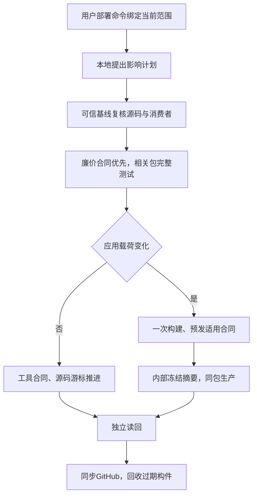

# 发布复盘优化：一次授权、可信选测、清理后重建 main

用户已授权按本工作台《CRM-v4部署复盘与最小流程建议》实施，并同步 GitHub、删除旧本地工作区及服务器无用构件/缓存/备份。本 PRD 继承该复盘；不重复索取批准。

参考：[Go 包及测试依赖与 JSON 事件](https://pkg.go.dev/cmd/go)、[Playwright 按项目/依赖组织验证](https://playwright.dev/docs/test-projects)。复用现有 Go base/head 消费图、affected_plan、quality_lanes、check_preparation、domestic_main_release、River 和安装收据；不新增发布队列。

## 范围

- 删除重复人类确认；摘要仍内部绑定准确对象。已有授权相关修复继承；无关新范围独立处理。
- 文档图片/审计记录与执行策略分开；OpenAPI 变化按路由/消费者，SQL 迁移按表消费者，依赖按实际 import；无法解析的部分扩大相应阶段并说明原因。
- Host 按审阅的测试文件合同和实际 import/路由/SQL 证据分组；整个文件内新增测试自动加入。未登记、源内容变化、共享Host变更保留完整适用检查；不按测试名关键词免检。
- 维护命令如旧表退休工具不在应用命令消费图时只更新源码；工具本身仍完整测试/构建验证。
- 便宜的 API/迁移/登记合同在长阶段前执行；明确失败停止后续工作；统一已有准备器、只要求适用安装收据。
- 已有准确 tree/base/toolchain/schema/fixture 检查继续复用；不以“相似”跨版本复用。轻量状态查询用于无变化轮询，安装/异常边界完整验包。
- 自动回收无引用旧包，当前/在途包和有效恢复引用保护。此次用户明确授权废弃全部旧版本备份；额外执行一次彻底清理。

## 边界与验收

OneID：不修改身份算法；Persistence：既有发布状态/锁；External Effects：不新增业务写或队列。无产品 UI 改动。生产业务表、业务审计/幂等收据、River任务不属于缓存，不删除。worker无HTTP服务，不用API readyz证明worker；用存活角色和既有队列合同。

验证：选择器/构建器/控制器故障合同；历史支付宝/邀请/统一资料候选计划对照；Linux工具合同、实际固定文件安装读回；GitHub main与国内main/生产源码游标一致；本地仅全新main；两服务器只留当前应用，健康与worker存活。普通工具发布不构建或重装应用、不备份数据库。未知安装状态先只读对账。
