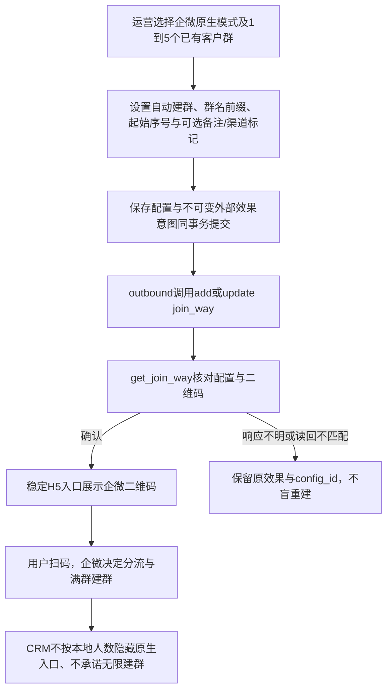

# 企微原生群邀请基准能力

用户授权：基于企微接口补齐群邀请能力（含自动建群），仅上共享预发布；不晋级生产。保留既有计划与稳定链接，新建计划默认企微原生，既有固定单群/顺序轮替可显式转换为原生模式。

## 官方合同与参考

- 官方：用户附图及 https://developer.work.weixin.qq.com/document/path/92229 。scene=2、chat_id_list最多5个、auto_create_room=0/1（官方默认1）、room_base_name最多40个UTF-8字符、room_base_id、remark及state最多30字符。采用显式自动建群配置，不依据传入5个群推断累计建群上限。
- GitHub EasyInk GroupCodeConstants/WeGroupCodeServiceImpl：区分外层稳定H5入口和企微单条群码配置。复用概念，不复制扫码次数当作成员人数。
- 有赞帮助 https://help.youzan.com/displaylist/detail_26_26-1-180074 ，艾客 https://www.ikscrm.com/school/qwzx/230.html ：原生与SCRM维护群池有区别，不作为官方API累计建群上限承诺。
- 产品目标沿用既有群邀请页面、admin_base、aud-*表格和表单、群目录选择器、公共H5。Product Design index/get-context/image-to-code已读取并执行user-context preflight；无新图片资产，无重设计。

## 行为与复用

1. 原生模式配置1到5个初始群，企微分流。新增自动建群（默认开启）、群名前缀、起始序号、备注、入群渠道state；保存后重新读取持久配置。
2. 原生模式由Provider配置确认决定入口可用，本地成员人数与目录过期不封禁原生扫码；不伪造当前唯一承接群、建群数量或成功入群。
3. 既有single/sequence行为不变。允许显式转换到native，保持素材ID、H5 token、config_id及二维码；转换期间保持准备中，未知结果不能被新配置覆盖。原生模式不自动回到CRM轮替。
4. 更新已有join_way并get读回；同一config_id/二维码确认后生效。幂等收据和完整参数摘要覆盖配置变化；不会自行调用批量拉人或独立建群API。
5. 群主权限、平台容量/风控及实际扫码结果由企微决定；页面说明避免承诺无限自动建群。
6. 满群列表仍展示绑定群及历史同步信息，原生模式明确为企微分配，不显示虚假的单群人数。

## 分类与影响

OneID不涉及：配置群ID，不匹配、建客或改变归属。Persistence：media拥有计划及不可变配置、审计/outbox同事务；复用jobqueue。External Effects：复用outbound/EER的KindInvitationCode，新增参数合同版本，保留v1/v2兼容，未知结果原键对账。

五项影响：管理/API输入与公共入口状态扩展；本地配置及企微join_way外部写行为扩展；media/wecom/outbound/webshell及其Host调用受影响；管理列表/表单与H5提示受影响；验证领域全包、Provider HTTP合同、PostgreSQL同事务/幂等/转换、真实Host浏览器保存读回及原生200人不封禁合同。

限制：原生每次选群最多5个、UTF-8参数长度复用官方边界；不新增累计建群数/扫码量上限。内部计划原有限制不批量修改。

## 验收与发布

覆盖自动开/关、5/6群边界、中文长度边界、所有参数传递/读回、失败/未知保留config_id、保存回读、转换保留入口、暂停与恢复、旧模式轮替、原生群200人后入口仍可见。数据库前向迁移仅增字段/拓宽模式约束，既有行默认值维持旧行为；不提供破坏性逆向SQL。发生问题停止创建/编辑原生计划，保留现有数据及原效果对账。

从当前累计预发92cac890出发（生产/国内main776bf5f2），准确候选推国内后实际投递唯一工作台；仅累计预发安装和相关合成旅程。真实企微自动创建新群、扫码入群与第六群的实际生命周期未以虚拟Provider证明；不操作生产群配置。

### 官方二维码地址兼容补修

企微get_join_way文档示例返回http://p.qpic.cn二维码。Adapter与现有二维码下载层统一仅接受wework.qpic.cn/p.qpic.cn官方图片域，将HTTP归一化为HTTPS；拒绝任意域、伪子域、userinfo、显式端口及fragment。参数和config_id读回核验不变。补修从原生能力候选fa4f59aa继续，作为明确Provider兼容缺陷交付，复用本PRD和UI QA。
