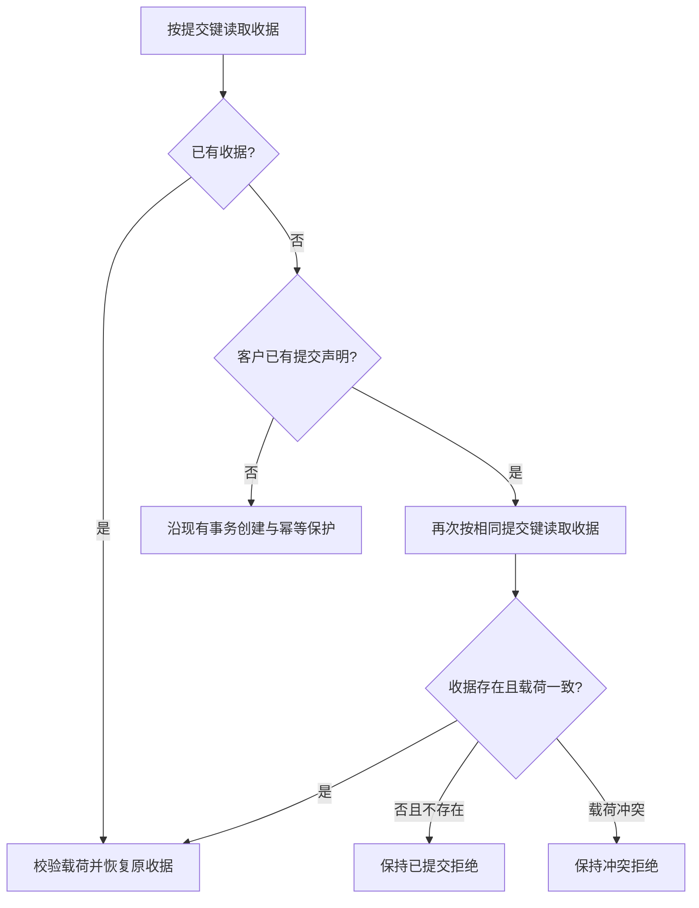

# 问卷同键并发提交收据恢复

沿已授权企微切换交付处理发布工作台回告的既有生产基线缺陷；不增加业务范围或页面。

准确 b908 基线的 Linux 真 PG 聚焦十次为九成功一次同键409；f1原生检查亦出现同一失败。Survey源码和测试在两者之间无差异。首个按键查询尚无行时，另一事务可能在后续客户声明查询之前提交；原逻辑把这种相同键重放误判为不同键重复提交。

参考 [PostgreSQL 16事务隔离](https://www.postgresql.org/docs/16/transaction-iso.html)：Read Committed每个语句取得新快照；复用本仓FindSubmissionByKey的载荷比较和CreateSubmission已有的冲突后收据重读，不升级数据库隔离或引入锁/新表。只在声明存在的早返回分支重读收据。

同键同载荷恢复同一submission ID和结果token；同键不同载荷仍冲突；不同键仍already_submitted。创建、观察者、审计、outbox、完成效果只发生一次。真PG测试用屏障固定首查询缺失→另一提交完整提交→声明存在的语句交错，另外验证冲突与不同键。完整Survey相关合同及原失败Host阶段重验后，与人群校准候选一起交付工作台，不单独生产安装。

分类：OneID只沿用已解析Customer，不匹配或合并；Persistence复用Survey UoW/收据；不新建任务或Provider效果。对外合同保持原已承诺幂等；业务修复收据恢复；关联Survey提交和完成效果；页面无改动；证据为准确候选真PG确定性交错、Survey专项及Host全阶段。无新增业务限制。
