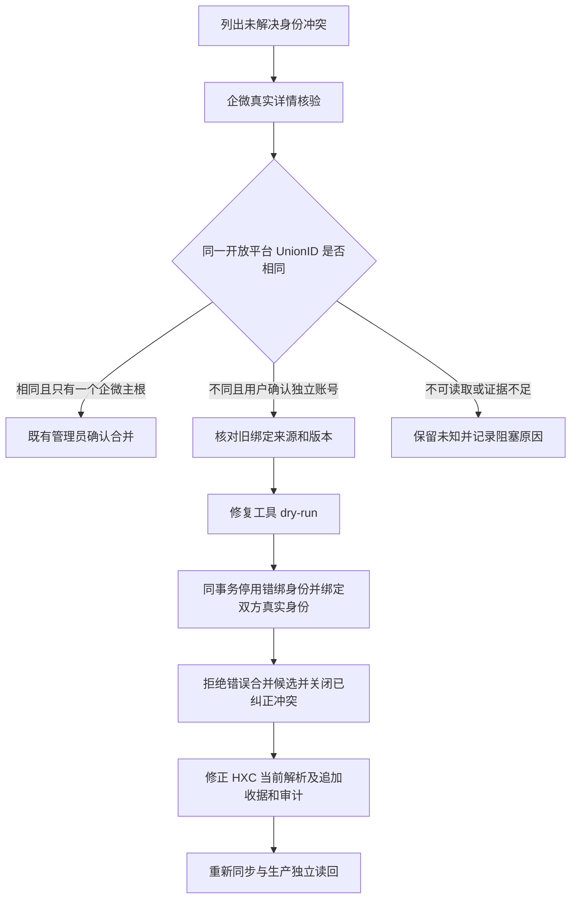

# 企微账号身份冲突的审计纠正

用户已授权登录生产纠正 85、按两个账号保留，并核查处理其余冲突。本能力补齐原统一资料同步 PRD 的身份冲突恢复路径，不增加页面。

参考：[OpenSCRM 员工客户模型](https://github.com/openscrm/api-server/blob/master/app/models/customer_staff_relation.go)按企微账号保存员工客户资料；本项目继续保留 OneID。并发纠正复用 [PostgreSQL 16 行锁](https://www.postgresql.org/docs/16/explicit-locking.html)、现有 Identity 锁序、平台 UoW 与不可变审计。企微官方客户详情文档入口 `https://developer.work.weixin.qq.com/document/path/92114` 本次浏览器不可读取；真实生产核验和仓库受测目录 Adapter 是本次接口证据，不把未读文档当作验证结果。

OneID：涉及身份归属，所有身份及来源状态更新只在 Identity Owner Store。Persistence：Provider 读取在事务外，纠正、来源当前解析、来源追加收据、证据、平台审计在一个 UoW；复用证据作为幂等收据。External Effects：不涉及企微写入和发送。无新增队列或身份匹配中心。

独立维护工具放 `cmd/migrate-wecom-account-identities`；默认 inspect，支持真实 Provider 验证 dry-run / apply。保护计划只包含客户/身份/候选/来源记录 ID、版本与 run key；不接受自报 verified 身份值，不输出原始企微 ID、UnionID、手机号或凭据。精确计划摘要绑定 apply，复用已有版本 CAS、主根和身份键锁；这是避免修复错误记录的必要约束，不增加无关审批。

修复只覆盖：两个活跃根各有一个同企业的企微身份、企微返回不同的同 scope UnionID、历史 hxc UnionID 错绑到另一企微根。停用旧身份而不移动其历史记录，分别创建真实当前 UnionID；保留客户、手机号、订单、运营执行与历史事实。来源当前判断改为已验证 UnionID 所属账号；历史解析收据追加保留。后续相同或变化的 HXC 载荷尊重该已审核的精确账号归属，不能再次按共享手机号生成合并候选。

五项影响：新增维护工具，没有新 HTTP 合同；Identity 当前归属及 HXC 同步解析改变；客户资料、HXC 看板、人群包间接读取新归属，但不改订单、支付、发送或企微资料表；无页面修改；验证包括拒绝错误 Proof/CAS、事务回滚、幂等重试、历史身份停用保留、候选/冲突收尾、HXC 原载荷重放及变化载荷不重建错误合并，最后真实生产读回。

发布走唯一 V4 指挥台，修复执行前保存保护计划和受影响身份/来源的备份与校验。工具不能用直接 SQL 临时绕过本命令；不得将其他缺证据冲突假装为已解决。运行失败保持原状态；已提交结果通过原 run key 读回，后续补偿也须重新核验 Provider，不能重新启用已证实错绑身份。初始化完成另以统一资料完整版本、基线状态和人群首次零触发校准验收。

生产补充证据：13:23 读回 run 144 正在发布，主跟进员工批量更新 SQL 已执行约 15 分钟；发布锁阻塞资料消费者。修复同一初始化恢复链路的发布查询：两个跟进员工聚合 CTE 显式 MATERIALIZED，使同一事务中新版本批量行尚未进入统计时，聚合也只计算一次。跟进人选择、原子发布与标签历史语义不变；补充同事务批量数据的正确性及容量验收，并运行企微领域测试。只做查询计划修复，不改发布控制器或生产数据库索引。
