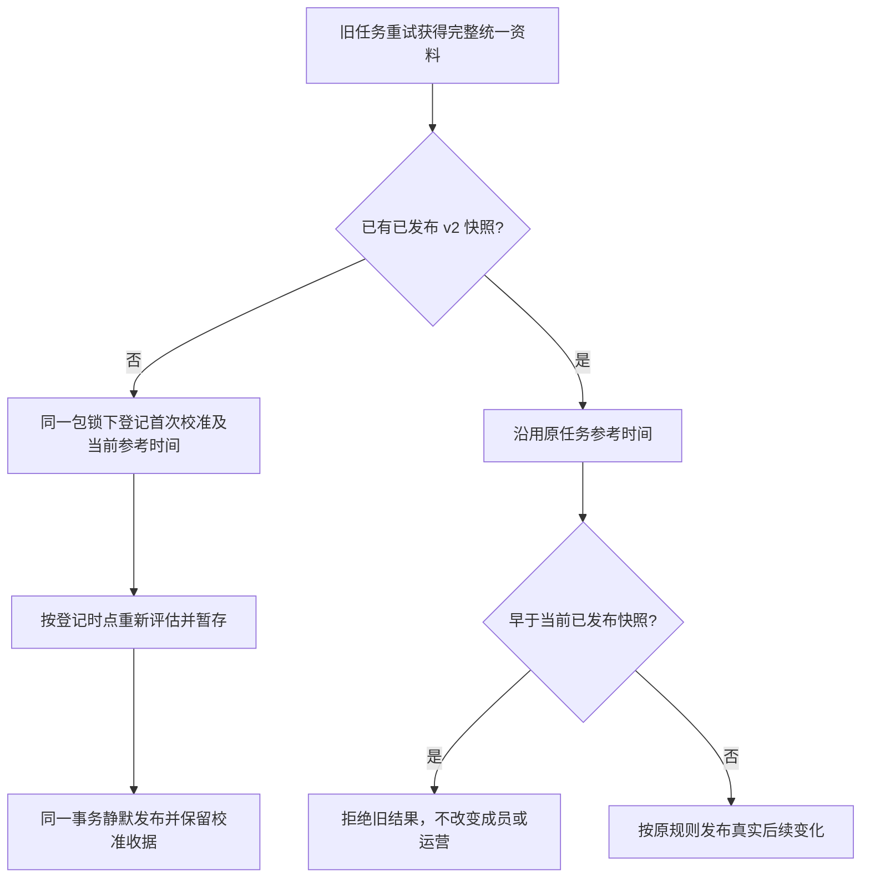

# 统一企微资料首次校准的积压刷新保护

复用已获授权的企微资料、标签基线及全人群包迁移 PRD。本次仅修复真实生产切换中发现的积压参考时间问题，无页面变更。

## 问题及范围

生产17:27:58有425条source不可用的自动刷新处于evaluating/River retryable，reference从12:03至17:27。原实现让任意第一次成功的旧任务静默切换，但按其旧reference评估；后续较新积压任务能发布此前几小时差异，可能误触发历史用户运营。暂停包不能阻断已接收任务。临时隔离只用现有River队列暂停，不停企微采集；准确修复安装且读回后才恢复。

## 参考和复用

官方 [River QueuePause/QueueResume](https://pkg.go.dev/github.com/riverqueue/river#Client.QueuePause) 与 [River变更记录](https://github.com/riverqueue/river/blob/master/CHANGELOG.md) 提供既有单队列暂停/恢复；已按实际锁定v0.24.0源码核对事务和通知语义。复用项目PrepareRefreshSources包锁、reference_time、source_rebase、发布时间保护、既有UoW/审计/事件和River，不引入第二套队列、身份或校准表。

## 行为

获得可信v2水位且原已发布快照未有v2时，在包锁内一次性将该run登记为source_rebase，把旧reference改为当前校准时点并记录前后时间审计；在暂存之前重新评估。重试复用已登记时点，不能向后漂移或退回旧时间。并发已登记的校准仍保持静默，较旧发布依靠既有时间保护拒绝。没有已有快照的新包保持正常初次入组；source不可用保留原快照。原idempotency、执行和历史收据保留。后续真实变化正常触发。

分类：OneID仅沿用客户主根及既有canonical Port，不匹配/建客/合并；Persistence是现有Segment-owned run/reference/audit同UoW；内部任务复用River；没有Provider读写或新增外部效果。新增限制仅修复已证明的首次校准时间漏洞，复用原时间保护。接口/DDL/组成根/页面不变；关联Segment刷新、成员资格与运营入组，必须验证真实PG积压时序及后续正常链路，工作台在准确候选上执行受影响检查和安装读回。
