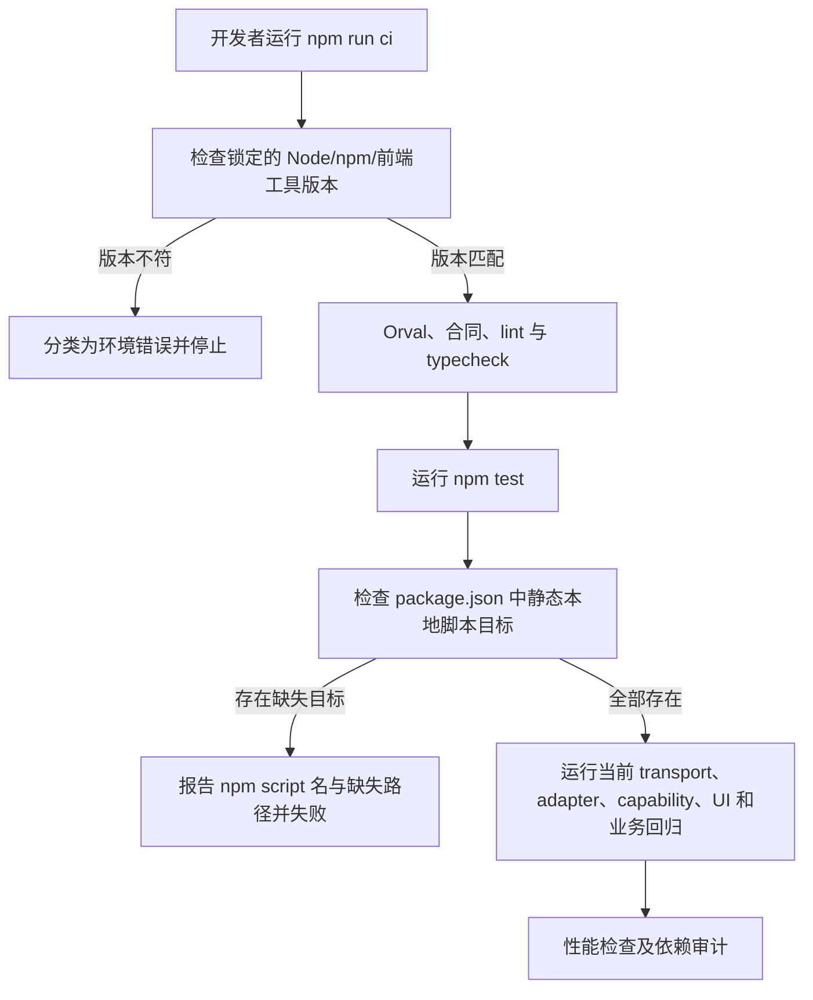

# PRD：npm 本地测试入口完整性

状态：本轮开发授权下冻结（限定为已复现的工具入口缺陷）  
基线：`origin/main` `6d3ee9ccd8e9b7ce36b9980507fb6e17d217977c`，tree `5639e2a2acfdb5d6f899493b09ca7e1146691ad9`  
工作包：W0 基线中的 P2 工具入口修复；不代表 W0/W1 全部完成

## 1. 业务判断与流程

开发者应能从 `npm run test` / `npm run ci` 进入当前仓库提供的前端回归。被声明的本地脚本目标必须存在；不存在的入口要在回归前以明确的命令名和目标路径失败，不能等到 shell 返回不易定位的退出码 127。

当前 `package.json` 声明 `edge:contract`、`release:contract`、`deploy:check`，分别指向不存在的 `scripts/test_g2_web_edge.sh`、`scripts/test_id_dev_web_release.sh`、`scripts/check_id_dev_deployment.sh`。`npm run edge:contract` 与 `npm run release:contract` 被 `npm run ci` 尾部调用，三个入口均独立复现退出码 127。仓库没有这些命令目标的替代脚本；`web/scripts/validate-release.mjs` 需要发布目录和源 SHA 参数，不等价于旧 `release:contract` 或 `deploy:check`。GitHub 主 CI 使用 `scripts/ci/quality_lanes.py` 的 lane，不调用这些旧 npm 别名。

实施选择：删除没有实现、且仓内没有调用方的三个旧 npm 命令；从本地 `ci` 链中移除对两个失效合同命令的调用。保留 `release:validate` 原有发布清单校验入口。将静态本地目标检查放入 npm 测试入口，后续 package script 若直接引用 `scripts/...` 或 `web/scripts/...` 下的本地文件，会由测试明确发现。

## 2. 成功标准

- `npm test` 包含一个不依赖 Node 模块或网络的 package-script 目标完整性测试。
- 检查器覆盖所有 npm script 字符串里的静态 `scripts/...`、`web/scripts/...` 文件目标；缺少文件时按 script 名输出错误并以非零退出。
- 当前 package scripts 的可识别本地文件引用全部存在。
- 现有 transport、adapter、capability、UI shell 和业务脚本顺序保留。
- `npm run ci` 不再调用失效旧目标；不把版本不符合锁定值归类为产品失败。
- 不改 `.github/workflows/ci.yml`、`scripts/ci/quality_lanes.py`、依赖版本或 lockfile，不访问数据库和 Provider。
- 历史 donor 的 `package.frozen.json` 与源摘要保持原样；根 `package.json` 作为当前执行入口单独维护。

## 3. 市场与 GitHub 参考

| 来源 | 可借鉴处 | 采用方式 |
| --- | --- | --- |
| [npm v11 scripts 文档](https://docs.npmjs.com/cli/v11/using-npm/scripts) | `package.json` scripts 是项目暴露给开发者的命令入口 | 对静态本地文件入口提供仓库内回归；保留 npm 自带的脚本解析行为 |
| [GitLab 单元测试报告](https://docs.gitlab.com/ci/testing/unit_test_reports/) | 将失败、错误和报告位置清楚呈现，便于定位 | 检查失败指出 npm script 与缺失路径，不输出笼统的 shell 错误 |
| [GitHub `actions/upload-artifact`](https://github.com/actions/upload-artifact) 与 [GitHub artifact 文档](https://docs.github.com/en/actions/tutorials/store-and-share-data) | CI 可以保存独立、可追溯的运行证据 | 此 PR 不改变 artifact/CI；继续复用现有 lane 证据输出 |

这些产品均比在仓库内自建新测试平台合适；本改动不引入其额外服务或依赖。

## 4. 复用与架构分类

- 复用根 `package.json`、现有 `npm test` / `npm run ci`、已有前端合同脚本及 Python 标准库 `unittest`。
- 不新建测试编排器，不改权威质量 lane，不改运行时、API、测试数据或部署路径。
- OneID：不涉及，测试配置没有客户或外部身份。
- Persistence：stateless，仅读取 `package.json` 和仓内文件，不读写数据库或业务数据。
- External Effects：不涉及，不联网、不支付、不发送消息、不触碰 release queue。
- 数据 Owner：仅 package 开发命令配置；无业务表、事务或迁移。

## 5. 权限、环境与验收

检查只在本地进程权限内读取静态文件。回归不会解析 shell 变量、执行脚本目标、读取环境变量秘密或做网络访问。该检查仅能证明字面本地文件引用存在，不证明脚本语义、运行环境、业务正确性或覆盖率。

| 检查 | 命令 | 验收口径 |
| --- | --- | --- |
| 检查器回归 | `python3 scripts/qa/test_package_script_targets.py` | 有效目标通过；缺失目标用例返回定位明确的差异；非本地命令不误报 |
| npm 暴露入口 | `npm run qa:script-targets` | 可独立调用并通过 |
| 前端测试入口 | `npm test` | 在锁定 Node/npm/依赖环境运行全部现有测试 |
| 项目快门禁 | `python3 scripts/dev_preflight.py fast` | 对准确 head/tree 记录 `fast` claim；不宣称完整回归 |

首次基线于 2026-09-25 在 `6d3ee9c` 运行：`fast` 门禁通过；`scripts/ci` Python unittest 为 188/188 通过；npm 锁定版本检查因本机 Node `24.21.0`、npm `11.19.0` 不符仓库要求 Node `24.18.0`、npm `11.12.1` 而失败。全部三条失效入口均退出 127。

五条 canonical lane 的本机状态：`preflight` 仅有 `fast` 与 188 项 `scripts/ci` Python 单测结果；完整 lane 未执行。`backend` 未执行；没有经过确认的隔离数据库 URL，未把监听的 localhost PostgreSQL 当测试库。`frontend` 未执行；锁定 Node/npm 不符。`browser` 与 `archive-sdk` 未执行；本机 Darwin/arm64 不满足 Linux amd64 前置。任何 lane 的“未执行”都不作 PASS。未连接数据库或真实平台。

## 6. 并行、回滚与交付

- 并行审计中，核心可靠性子任务仅改 `internal/externaleffects/store_integration_test.go`，浏览器子任务仅改 `cmd/aicrm/` 问卷 Journey；与本 PR 文件无重叠。
- V4 文档指定 `49.232.57.128` 为预发布节点；主任务只读检查发现 `/etc/aicrm/domestic-release-role` 缺失，`pg_config` 显示 18.6 客户端。因此 staging/live release queue 的运行状态无法验证，W1 记为 BLOCKED；未更改主机配置。
- `origin/main` 经 2026-09-25 fetch 仍是 `6d3ee9c`。开放 PR #52/#53/#50/#46 等为其他业务/发布范围；不修改它们。
- 主任务已创建 Draft PR #55（候选 head `9bbbf28`，base `6d3ee9c`）。它和本分支都是未合并开发候选；均不得记作 `origin/main` 新版本或生产版本。此 PR 不宣称生产 SHA。
- 这是工具配置与测试门禁变更，`change_class=governance_only`；runtime package、staging app install、业务运行时读回为 N/A。此状态不代表已满足整体发布验收。
- 回滚为 revert 此 PR commit，恢复三个旧 npm 别名及原 `ci` 字符串；不需数据库或外部资源清理。
- 用户可观察结果：失效别名不再出现；有效本地测试目标受回归检查保护。实际前端 suite 仍须在锁定工具环境运行。
