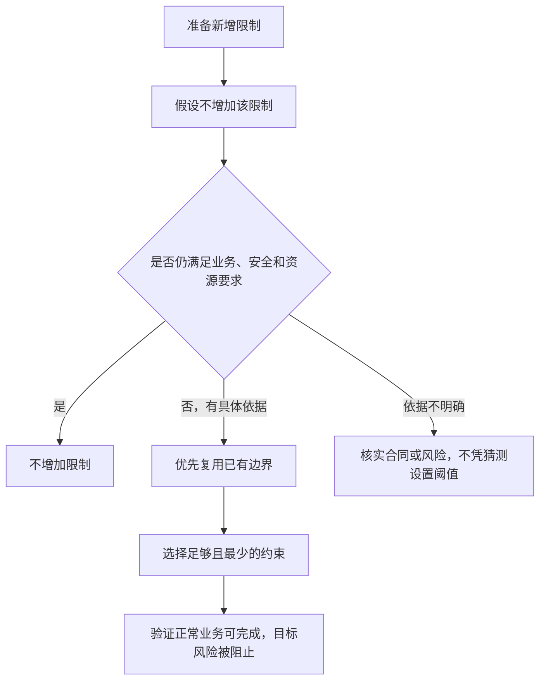

# AI-CRM-v4 Development Decision Manual

## Completion contract

Before editing, classify the business judgment, acceptance journey, OneID,
Persistence, and External Effects boundaries. Completion requires a clean,
committed worktree and test evidence bound to its exact head/tree. GitHub PR
`check`, staging build/install, production technical health, and real business
acceptance are separate facts. A compile, mock, HTTP 200, synthetic fixture,
or queued Provider effect is not completed business acceptance.

Use this skill after reading the repository `AGENTS.md`. Its purpose is to make OneID and durable execution deliberate shared foundations without turning them into universal dependencies.

## Small-step delivery

Follow `skills/aicrm-v3-development-frontdoor/SKILL.md`: keep the parent brief in one Codex task, deliver one independently mergeable behavior or defect with its tests in each PR, and use Product Design before UI implementation. Split by behavior, without line-count quotas. An authorized parent brief carries into child PRs; request a new decision only for material scope or contract changes. Release-failure diagnosis and fixes use a separate `gpt-6-luna` max agent; other tasks are not restricted to that model.

## Start With a Two-Axis Classification

Before editing code, record a short decision in the implementation plan or PR:

```text
OneID: not involved | reads canonical customer | resolves identity | provisions customer | links/merges identity
Persistence: stateless | local transaction | internal durable job | Provider read | Provider write/external effect
```

If an axis is not involved, state why and continue without adding a dependency. Revisit the classification when scope changes.

## 限制必要性判断（奥卡姆剃刀原则）

本规则仅约束今后新开发中新增的限制，不要求审计或批量修改既有限制。权限、字符长度、格式、数量、超时、重试和额外审批步骤都适用。

> 每增加一个限制，先假设没有它，判断业务正确性、安全边界和资源承载是否仍然成立。成立则不增加；不成立则采用有明确依据、足以解决问题的最小约束。



- **业务和输入限制**：阈值来自已确认业务规则、数据库或 Provider 合同、具体资源预算；不凭习惯设置 100、255、1000 等数值。已有边界足够时，不新增更严的重复限制。
- **权限**：按实际操作授予最少权限，并保证完整操作链能够执行。受保护资源仍须进行授权判断并默认拒绝未授权访问；参照 [OWASP 最小权限和默认拒绝原则](https://cheatsheetseries.owasp.org/cheatsheets/Authorization_Cheat_Sheet.html)。不得以“最少限制”为由绕过身份、事务、外部效果或凭据保护红线。
- **作用范围**：限制施加于需要保护的对象和环节，避免把服务、凭据的私有权限要求机械套到源码快照、CSS 等不同用途的文件上。
- **限制反馈**：必要限制被触发时，明确说明原因和可行修正方式；字符超限不得静默截断。

在 PRD 或 PR 中简短记录新增限制：

`限制对象｜不限制的具体后果｜依据｜最小约束及作用范围`

没有新增限制时，写一句“不涉及新增限制”即可；无需逐个参数创建台账。核实依据后，结论应明确为“不加”“复用已有边界”或“增加最小必要约束”。

### 示例

- **临时源码快照**：根据读取者和文件用途确定权限，验证创建、读取和检查的完整链路；不修改发布服务或凭据权限，也不预设所有快照必须全局可读。检查器应判断所需权限是否满足，不能仅因文件权限与某个无依据的固定值不同而拒绝正确的 CSS。
- **自由文本长度**：没有业务或技术依据时不添加额外字段长度限制；确有下游上限时，说明按字节、字符或其他单位计量、阈值来源和错误反馈，并验证边界内正常输入与超限反馈。已有请求大小或资源保护仍按其自身依据生效。

## OneID Decision

OneID is involved when a capability reads or assigns a customer, accepts an external identity, correlates channels, or changes identity ownership.

When involved:

- Use `customers.id` as the channel-neutral customer key.
- Resolve external identities through `internal/identity/port`; do not query identity tables or reproduce matching rules.
- Preserve identity `kind`, `scope`, `value`, `assurance`, and `source`. OpenID and UnionID must retain their required scopes.
- Treat Provider verification as an internal Adapter fact. HTTP payloads cannot declare themselves verified.
- `Resolve` does not create a customer. Provision only through the explicit verified-identity use case.
- Keep uncertain evidence pending or conflict. Do not guess, silently merge, or bind to the nearest customer.
- Cross-root identity evidence creates an auditable merge candidate unless a separately approved workflow permits more.

OneID is normally not involved in local configuration, content definitions, product rules, diagnostics, or other records that do not identify a customer. Do not add `customer_id` merely for uniformity.

## Persistence and Execution Decision

Classify work by observable side effect:

### Stateless or local transaction

- Keep durable business state in PostgreSQL 16 under one table Owner.
- Commit business state, idempotency receipt, audit, and Outbox in one Unit of Work when they belong to one command.
- Use locks, CAS, or versions for concurrent changes.

### Internal durable job

Use `internal/platform/jobqueue` for restart-safe internal work such as scheduled evaluation, snapshot preparation, or directory refresh. An internal job is not automatically an External Effect.

Do not introduce an in-process ticker, a domain-specific worker framework, or another retry table.

### Provider read

Use the owning connector read Adapter, such as `wecom` for trusted directory facts. Record safe audit facts and failure stages, but do not label a read as an executed outbound effect.

### Provider write or other external effect

- The business domain freezes an immutable intent; it does not call the Provider.
- WeCom business writes go through the sole `outbound` owner.
- Submit the opaque intent through `internal/externaleffects/port`; reuse its queue, generation, lease/fence, attempts, receipts, retry classification, and reconciliation.
- Use stable source, target, payload, and policy digests plus a stable idempotency key. Retrying the same logical operation must not mint a new key.
- Keep raw customer IDs, `external_userid`, openid, phone numbers, message bodies, tokens, and Provider responses out of External Effects tables and structured logs.
- Store the `effect_id` binding in the owning business domain, then consume effect status through a stable read Port or versioned event. Never query another domain's tables.
- `accepted` or `queued` is not Provider success. `executed` is not delivery proof. `outcome_unknown` permits only original-key lookup, trusted callback, explicit reconciliation, or Provider-authorized idempotent retry.

Payment and refund effects must reuse these reliability semantics through an explicitly versioned payment contract. Never disguise them as outbound messages.

## Coordination Check Before Implementation

When OneID or External Effects is involved, confirm:

1. Which domain owns the business record and table?
2. Which stable Port or versioned event is used?
3. Does the command require one PostgreSQL Unit of Work?
4. What is the deterministic idempotency scope?
5. For an external effect, what are its kind and four immutable digests?
6. Where is the business record to `effect_id` relationship stored?
7. Who owns Provider reads, Provider writes, callbacks, and reconciliation?
8. How are restart, replay, concurrent execution, and `outcome_unknown` tested?
9. Has the implementation avoided a second customer identity system, queue, Worker, retry loop, or effect state machine?

Do not assume the current adapter participates in the caller's Unit of Work. Verify it. If effect acceptance opens an independent transaction while the business command requires atomicity, treat that as an architecture gap and fix the shared Port/adapter rather than compensating in the business module.

## Completion Evidence

PR 记录准确 HEAD/tree、适用测试及未验证事项。受保护 `main` 的准确提交 `check` 成功后，
预备机按第一父链构建并验证，再以同一文件树晋级生产。每一步单独记录 SHA、摘要、
版本和健康读回；纯文档提交不做无意义的应用安装。生产技术安装完成后再记录真实
支付、扫码等业务结果，未有结果时不能声称业务验收完成，也不占用下一次技术发布。

部署结果不明时只读对账，不重复安装。预备机使用虚拟 Provider 时，其结论只证明
虚拟合同和确定性状态转换，不得写成真实外部效果通过。操作流程见
`docs/operations/domestic-release.md`。

The PR should contain a compact section like:

```text
OneID decision: involved/not involved, with reason and Port used
Persistence decision: classification and transaction boundary
External Effects decision: involved/not involved, kind/idempotency/reconciliation when applicable
No-duplication evidence: no new identity matcher, Provider writer, queue, Worker, retry, or reconciliation kernel
```

These are review prompts, not universal feature gates. Apply only the relevant tests and contracts, but never omit the initial classification.

## Stop Conditions

Stop and report instead of improvising when the design would cause identity misattribution, implicit customer creation, cross-domain table writes, independent commits that can split one required transaction, duplicate Provider effects, blind retry of `outcome_unknown`, or a second execution/identity kernel.
